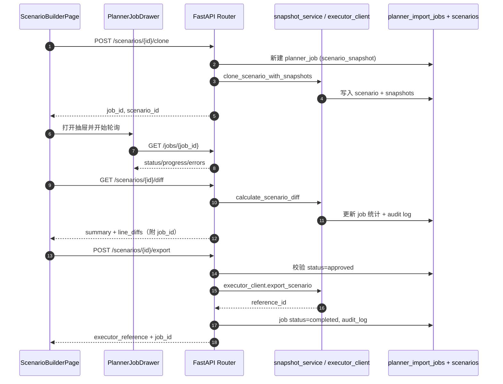

## 1. Scope Overview

The costing planner module introduces a multi-phase rollout that layers core CRUD tooling, scenario modeling, and downstream integrations on top of the existing AI Costing System. The FastAPI-based backend (`backend/src/planner`) owns data persistence and workflow logic, while the React/Ant Design frontend (`frontend/src/pages/PlannerWorkspace.tsx`, `ScenarioBuilderPage.tsx`) provides workspace UX. All APIs are namespaced under `/api/planner`.

## 2. Phase Plan

| Phase | Focus | Backend Deliverables | Frontend Deliverables | QA/Docs |
| --- | --- | --- | --- | --- |
| Phase 1 – Core Planner CRUD | Initiatives, cost packages, line items, imports, assumption registry | Tables & models (`cost_initiatives`, `cost_packages`, `cost_line_items`, `input_assumptions`, `planner_import_jobs`), CRUD routers, CSV import worker | Planner workspace (initiative list/detail, package tree, line-item grid), import wizard, inline edits | CSV验证套件、导入冒烟测试、操作手册 |
| Phase 2 – Scenario Modeling & Approvals | Scenario lifecycle, variance, approvals, AI hooks | Snapshot engine (`scenario_versions`, `scenario_line_snapshots`), diff + clone services, approvals router, audit trail | Scenario Builder（克隆/差异/审批/Job Drawer/AI 面板） | 场景差异回归、审批流测试、审计检查 |
| Phase 3 – Integrations & Enhancements | Export to costing executor, AI helper UI, audit UX, attachment viewer | Executor client, export job orchestration, benchmark suggest API stub, audit log service, attachments router | 导出 UX、AI 建议卡片、Audit Drawer、附件查看器 | 端到端回归（克隆→差异→审批→导出）、导出对账、AI QA checklist |
| Phase 3.5 – 生产集成 & 可观测性 | 真实 executor/benchmark、收藏、消息总线、指标 | 实际执行器客户端、AI Benchmark 代理、`/planner/scenarios` 列表与收藏 API、Kafka/RabbitMQ 事件、Prometheus `/metrics` | `/planner/scenarios` 列表/收藏、导出历史时间轴、Job/Audit Trace、AI 收藏同步 | Staging UAT、生产部署 checklist、消息事件验证、Trace 回放 |

> Phase 0 “Foundations” (requirements, ERD, migrations) is tracked in `DOC/costing/requirements.md` and assumed complete once migrations and routers skeletons exist.

## 3. Phase Architecture Snapshot

### Phase 1 – 数据建模与 CRUD
- **前端层**：`PlannerWorkspace` 三栏布局（Initiative 列表 → 详情 → 包树 + 行表），Zustand 负责选中态；React Query 统一请求缓存。
- **服务层**：FastAPI `initiatives/packages/line-items/assumptions` 路由 + `planner_import_jobs` 表；CSV 导入由 `import_service` 串行处理。
- **数据层**：`cost_initiatives` → `cost_packages` → `cost_line_items` → `supplier_quotes` 形成核心树，全部具备软删除与时间戳，满足审计。

### Phase 2 – 场景与审批闭环
- **前端层**：`ScenarioBuilderPage` 激活克隆、差异、审批、AI 面板；`PlannerJobDrawer` 成为所有异步任务入口。
- **服务层**：`snapshot_service` 管理 `scenario_versions`/`scenario_line_snapshots`，`approvals` 路由写入 `approval_records`；`audit_service` 记录关键动作。
- **数据层**：场景快照与审批表支撑 `clone → diff → approve`，并串联 `input_assumptions`、`scenario_line_snapshots` 实现差异分析。

### Phase 3 – 导出、AI、审计增强
- **前端层**：导出表单、AI Benchmark 列表、Audit Drawer、Attachment Viewer；支持多 job 类型统一抽屉与收藏交互。
- **服务层**：`executor_client`（mock）负责 `/scenarios/{id}/export`，`benchmarks` 路由返回 AI 建议占位，`audit_logs` 对接 Drawer。
- **数据层**：`planner_import_jobs` 扩展 job_type，记录 export/diff/clone；`audit_logs` 成为追踪源；附件表准备 Phase 3.5（OSS 接入）。

### Phase 3.5 – 生产集成 & 可观测性
- **前端层**：`/planner/scenarios` 列表/收藏、场景导出历史时间轴、AI Benchmark 收藏、Audit/Job Drawer Trace ID。
- **服务层**：真实执行器客户端（HTTP/gRPC，重试+断路器）+ `/executor/callback` HMAC 校验、场景列表/收藏 API、AI Benchmark 代理 + 缓存 + fail-open 策略、Kafka/RabbitMQ 事件发布（重试 + fallback 告警）、Prometheus `/metrics`。
- **数据层**：新增 `scenario_favorites`、`benchmark_favorites`、`planner_executor_callbacks`，`audit_logs` 补充 trace_id，`planner_import_jobs` 记录 `scenario_export` 作业；所有关键操作写入审计与指标。

## 4. 模块关系图

```mermaid
graph LR
  subgraph Frontend (React + AntD)
    A[PlannerWorkspace] --> B[PackageTreePanel]
    A --> C[LineItemsTable]
    D[ScenarioBuilderPage] --> E[PlannerJobDrawer]
    D --> F[AuditLogDrawer]
    D --> G[AI Benchmark Panel]
  end

  subgraph Backend (FastAPI)
    H[routers.initiatives]
    I[routers.packages]
    J[routers.line_items]
    K[routers.scenarios]
    L[routers.approvals]
    M[routers.benchmarks]
    N[routers.jobs]
    O[routers.audit]
  end

  subgraph Services
    P[import_service]
    Q[snapshot_service]
    R[audit_service]
    S[executor_client]
  end

  subgraph DB (PostgreSQL)
    T[cost_initiatives]
    U[cost_packages]
    V[cost_line_items]
    W[scenario_versions]
    X[scenario_line_snapshots]
    Y[planner_import_jobs]
    Z[audit_logs]
  end

  A -->|GET /initiatives| H
  B -->|GET /packages/tree| I
  C -->|GET/PATCH /line-items| J
  D -->|POST /scenarios/*| K
  D -->|POST /approvals/*| L
  G -->|POST /benchmarks/suggest| M
  E -->|GET /jobs/{id}| N
  F -->|GET /audit| O
  J --> P --> Y
  K --> Q --> W
  L --> R --> Z
  K --> S --> Y
  H --> T
  I --> U
  J --> V
  Q --> X
```

## 5. 关键 API 流程



> 如需更细颗粒的流程图（例如 CSV 导入、审批流通知），可在 `docs/mermaid` 目录新增分图并在此引用。

## 6. API Surface (v1)

| Resource | Method | Path | Purpose / Notes |
| --- | --- | --- | --- |
| Health | GET | `/api/planner/health` | Readiness probe from CI/monitors |
| Initiatives | GET | `/initiatives` | Paginated list with filters (status, owner, tags) |
|  | POST | `/initiatives` | Create initiative; enforces unique `code` |
|  | GET | `/initiatives/{id}` | Fetch detail + aggregates |
|  | PATCH | `/initiatives/{id}` | Partial update (status, owner, metadata) |
| Packages | GET | `/packages` | Flat list (filter by initiative, parent) |
|  | GET | `/packages/tree` | Tree response powering package sidebar |
|  | POST | `/packages` | Create package |
|  | PATCH | `/packages/{id}` | Update (status, owner, notes) |
| Line Items | GET | `/line-items` | Paginated grid; supports package/type filters |
|  | POST | `/line-items` | Create single item (used by inline add) |
|  | PATCH | `/line-items/{id}` | Update quantity/unit cost/status/supplier |
|  | POST | `/line-items/import` | Upload CSV → async job |
|  | GET | `/line-items/import-jobs/{job_id}` | Job polling |
| Assumptions | GET | `/assumptions` | List per initiative/type |
|  | POST | `/assumptions` | Add assumption version snapshot |
| Scenarios | POST | `/scenarios` | Manual scenario creation (admin) |
|  | POST | `/scenarios/{id}/clone` | Clone baseline + optional subset |
|  | GET | `/scenarios/{id}/diff` | Variance analysis vs another scenario |
|  | POST | `/scenarios/{id}/export` | Approved scenario export trigger |
| Approvals | POST | `/approvals/submit` | Move scenario to “in_review” |
|  | POST | `/approvals/approve` | Approve + optionally set baseline |
|  | POST | `/approvals/reject` | Reject with comment |
| Benchmarks | POST | `/benchmarks/suggest` | AI helper placeholder returning curated suggestions |
| Jobs | GET | `/jobs/{job_id}` | Unified job drawer polling (import, diff, clone, export) |
| Audit | GET | `/audit` | Retrieve audit log by `target_type` + `target_id` |

Future endpoints (Phase 3+) will include `/sync/export-status`, `/attachments`, and `/projects` once project/grouping features kick in.

## 7. Frontend ↔ Backend Collaboration

### 4.1 Initiatives & Line Items
1. `PlannerWorkspace` bootstraps by calling `GET /initiatives` and auto-selecting the first record for context.
2. When an initiative is selected, React Query fetches `/packages/tree` for the panel and `/line-items` for the grid.
3. Inline edits trigger `PATCH /line-items/{id}`; optimistic updates are handled via Zustand store (`usePlannerStore`).
4. Bulk imports funnel through `POST /line-items/import`, store the returned `job_id`, and let `PlannerJobDrawer` poll `/line-items/import-jobs/{job_id}` until completion, surfacing row-level errors from `planner_import_jobs.errors`.

### 4.2 Scenario Lifecycle
1. Scenario Builder keeps a local list of scenarios (manual entry or API results) and interacts with backend via:
   - Clone: `POST /scenarios/{id}/clone` → snapshot service duplicates lines, logs audit, and returns new scenario id + job id.
   - Diff: `GET /scenarios/{id}/diff` → backend calculates variance and records a `scenario_diff` job for traceability.
   - Approval: `/approvals/*` endpoints update status and optionally baseline flag; audit log captures each action.
2. Export is gated: `POST /scenarios/{id}/export` rejects unless status=`approved`. Backend hands payload to `executor_client`, stores executor reference, and frontend surfaces job status via the job drawer.

### 4.3 Scenario List、AI Helper & Auditability
1. `/planner/scenarios` 通过 `GET /api/planner/scenarios` 加载，支持状态、Owner、Initiative、Baseline、收藏、多关键字搜索。行内收藏调用 `POST/DELETE /scenarios/{id}/favorite` 并与 Scenario Builder 收藏同步。
2. 批量操作：选中 `draft/rejected` 场景可批量提交审批，选中 `approved` 场景可批量导出；所有操作写入 `planner_import_jobs` 和 `audit_logs`。
3. AI Benchmark Panel 调用 `POST /benchmarks/suggest`（Phase 3.5 接入真实 provider），返回供应商、币种、置信度、数据时间；收藏接口 `/benchmarks/favorites` 持久化喜好。
4. `AuditLogDrawer` 支持 trace/关键字过滤、分页、JSON 导出；Scenario Builder 左侧导出历史时间轴直接读取 `/audit` 数据便于对账。
5. QA 依赖 audit payload + trace_id 重放 clone/diff/approval/export/消息事件链路。

### 4.4 Collaboration RACI
| Activity | Frontend | Backend | QA/Docs |
| --- | --- | --- | --- |
| API schema definition | Consume OpenAPI via FastAPI docs; align DTO naming | Own Pydantic models & validation | Validate contracts, publish examples |
| Bulk import | Build uploader, progress UI, error surfacing | Stream CSV rows, validate, persist job status | Provide validated CSV samples + replay scripts |
| Scenario operations | Form validation, job drawer, diff tables | Snapshot + diff engine, approvals, audit logging | Regression kit using fixture DB + API playback |
| Export & integrations | Trigger export, show job/executor reference | Bridge to executor service, manage retries | End-to-end verification, reconciliation scripts |
| AI helper | Panel UX, favorites, caching | Provider integration, throttling, fallback data | Accuracy checks vs known benchmarks |

## 8. Deployment & Observability Notes
- **Services**: Planner routers运行在主FastAPI进程（8000端口）；Phase 3.5 起 executor & benchmark client 可配置超时/重试/断路器。
- **Metrics**: 暴露 `planner_job_duration_seconds`, `scenario_export_fail_total`, `benchmark_latency_seconds` 等 Prometheus 指标。
- **Audit & Compliance**: 所有高风险动作写入 `audit_logs`（含 trace_id、external_reference、payload），配合导出历史/审计 Drawer 追踪。
- **Error Handling**: CSV 导入与 clone/diff/export 任务在 `planner_import_jobs.errors` 中记录细节，Job Drawer 可直接复制 payload/result 协助排查。
- **Message Bus**: Kafka/RabbitMQ topic `planner.events` 发布 `SCENARIO_APPROVED / EXPORTED / DIFF_READY`，用于通知与外部集成；trace_id 贯穿消息体。

## 9. 生产部署 Checklist

| 角色 | 步骤 | 说明 |
| --- | --- | --- |
| Backend | 1. 备份数据库与 `.env`; 2. `alembic upgrade head`; 3. 配置 `EXECUTOR_BASE_URL`, `EXECUTOR_API_KEY`, `BENCHMARK_API_KEY`, `MESSAGE_BUS_BROKER`, `PROMETHEUS_ENABLED=1`; 4. 启用 `PLANNER_FEATURE_EXECUTOR=real`, `PLANNER_FEATURE_BENCHMARK=real`; 5. 验证 `/api/planner/health`、`/metrics`、`/scenarios` | 如外部依赖不可用，立即切回 `mock` 并降级 feature flag；确保 `planner_executor_callbacks` 表可写 |
| Frontend | 1. 更新 `.env.production` 中 API BASE、Feature Flags；2. `npm run build:prod` (bundle < 400kB gz)；3. 上传最新 SVG 截图；4. 在 `/planner/scenarios`、`ScenarioBuilder` 冒烟（导入→克隆→审批→导出→AI）；5. 检查 Trace ID 复制功能 | 若接口返回 404/401，优先检查 feature flag 与版本兼容性，必要时回滚至上一构建 |
| QA | 1. 使用 `DOC/costing/qa/sample_data` 与 `phase4_regression.md` 执行回归；2. 记录每个 Case 的 trace_id/job_id；3. 验证 Kafka/RabbitMQ 事件（可通过消费者脚本） | 发现缺陷需附 trace_id + scenario_id + job_id，便于跨团队排障 |
| Ops | 1. 配置 Prometheus + Alertmanager 监控上述指标与消息堆积；2. 预置 rollback 脚本（关闭 flag → 恢复 DB 备份 → 重启服务）；3. 确认对象存储/回调地址白名单 | 若 executor/benchmark 服务异常，先断路器熔断，必要时切换 mock 模式 |

## 10. References
- Requirements: `DOC/costing/requirements.md`
- Frontend workspace: `frontend/src/pages/PlannerWorkspace.tsx`
- Scenario builder & manuals: `frontend/src/pages/ScenarioBuilderPage.tsx`
- User guide: `DOC/costing/manuals/planner_user_guide.md`
- Handover: `DOC/costing/handovers/rd_handoff_phase3.md`

