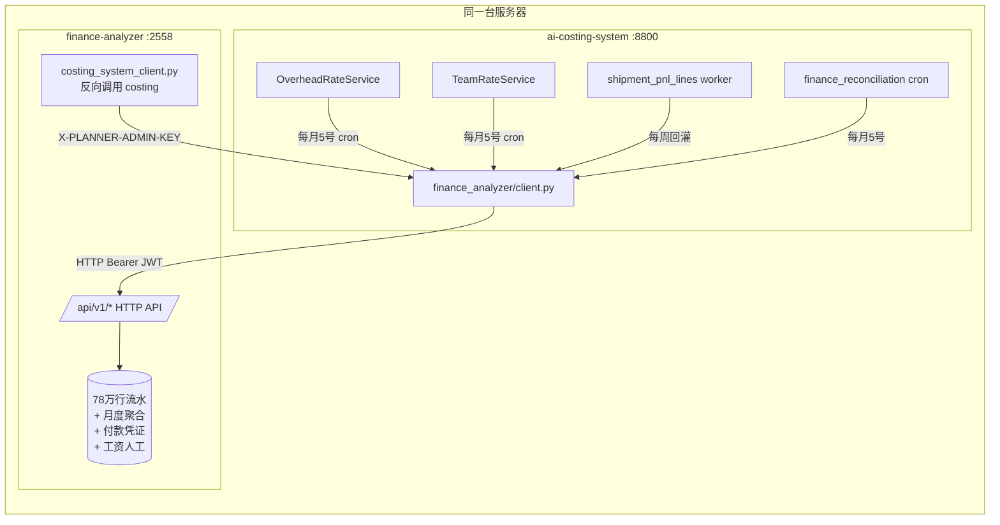

# finance-analyzer 集成方案 v1

> 状态：v1 草案 · 待四方评审（财务 / 工厂 / 运营 / finance-analyzer 团队）
> 关联：[价格成本盈亏分析专业版](../../../.cursor/plans) Phase 1A0 / Phase 2E
> 上游系统：`/home/admin/projects/finance-analyzer/`（FastAPI · `127.0.0.1:2558`）
> 下游系统：`ai-costing-system/`（FastAPI · `127.0.0.1:8800`）

## 0. 摘要（2 分钟读懂）

`finance-analyzer` 已经沉淀了 **78 万行银行/支付宝流水**（覆盖 2024-12 ~ 2026-01）和完整的会计科目分类（H02/H03/H04 资金归集、F01/F02 销售收入、A 系列管理费用、C 系列财务费用、D 系列采购应付款）。`ai-costing-system` 当前算成本的"制造费率 30%"是写死的常量，"班组单价"是拍脑袋推导的——这两个数据**完全可以从 finance-analyzer 月度反推**。

本方案约定：

1. `ai-costing` 在 `backend/src/integrations/finance_analyzer/client.py` 新建 HTTP 客户端，调用 `finance-analyzer` 的 8 个核心 API
2. 反推链路覆盖 4 个用途：制造费率 / 班组单价 / 平台扣款回灌 / 月度对账
3. 所有调用 fail-open，finance 不可用时退回手工配置 → 兜底常量，不阻塞主流程
4. 双方系统通过 Bearer JWT 认证（finance 颁发服务账号 token）

**重要事实**：`finance-analyzer` 内部 [`backend/app/services/costing_system_client.py`](../../../../projects/finance-analyzer/backend/app/services/costing_system_client.py) 已经在反向调用 `ai-costing` 拉发货数据，本次集成会形成完整的双向闭环。

---

## 1. 系统拓扑



**网络层**：同主机 localhost 调用，无 VPN/网关，延迟 < 5ms

---

## 2. 鉴权与配置

### 2.1 鉴权方案（待评审）

**首选：Bearer JWT 服务账号**

- finance 团队为 `ai-costing` 颁发一个长期有效的服务账号 token（建议 1 年有效期，到期前自动续期）
- token 存到 `ai-costing` 的 `.env`：`FINANCE_ANALYZER_TOKEN=eyJhbGciOiJIUzI1NiIs...`
- 调用时附带 Header：`Authorization: Bearer <token>`

**备选：API Key（如 finance 团队无法颁发服务账号）**

- 参照 finance 已有的 `X-Ingest-Key`（`/api/v1/sms-ledger/ingest-raw` 在用）模式
- 在 finance 侧新增 `X-Costing-Key`，写死在 finance settings + ai-costing .env 双方对齐

> **决策点 1**：用 Bearer JWT 还是 API Key？建议优先 JWT，统一鉴权体系；如评审时 finance 团队认为颁发服务账号工作量大，再退回 API Key。

### 2.2 环境变量清单

`ai-costing` 侧 `.env` 新增：

```ini
FINANCE_ANALYZER_BASE_URL=http://127.0.0.1:2558
FINANCE_ANALYZER_TOKEN=                            # finance 团队颁发
FINANCE_ANALYZER_TIMEOUT_SECONDS=15
FINANCE_ANALYZER_FAIL_OPEN=true                    # 失败时退回手工/兜底，不阻塞
FINANCE_ANALYZER_DEFAULT_COMPANY_ID=               # 集团默认主体（多公司时按调用参数覆盖）
FINANCE_ANALYZER_RETRY_MAX=2
FINANCE_ANALYZER_CACHE_TTL_SECONDS=3600            # 月度数据本地缓存 1 小时
```

`finance-analyzer` 侧 `.env` 新增（仅 API Key 方案需要）：

```ini
COSTING_INGRESS_KEY=                               # 与 ai-costing 对齐
```

### 2.3 健康检查

`ai-costing` 新增 endpoint：

- `GET /api/planner/integrations/finance-analyzer/health` 返回：

```json
{
  "status": "up | degraded | down",
  "finance_base_url": "http://127.0.0.1:2558",
  "last_success_at": "2026-05-08T20:30:00+08:00",
  "last_error_at": null,
  "last_error_message": null,
  "consecutive_failures": 0
}
```

监控集成到现有 Prometheus（`/metrics` 已存在）：

- `finance_api_requests_total{endpoint, status}`
- `finance_api_request_duration_seconds_bucket`
- `finance_api_consecutive_failures`

---

## 3. 关键 API 映射（核心：8 个接口）

### 3.1 月度间接费总额（反推制造费率）

**finance API**：`GET /api/v1/ledger/summaries?period=YYYYMM`

**响应字段**（节选）：

```json
{
  "period": "202604",
  "company_id": 1,
  "income_total": 5234567.89,
  "expense_total": 3567890.12,
  "expense_by_category": {
    "A01": 12000.00,    // 管理费用 纳税社保
    "A08": 56000.00,    // 管理费用 物流费用
    "A18": 80000.00,    // 管理费用 租金/物业
    "A19": 18000.00,    // 管理费用 水电费
    "A21": 240000.00,   // 管理费用 劳务费
    "C05": 8000.00,     // 财务费用 手续费
    "D01": 1850000.00,  // 采购应付款 主材
    "...": "..."
  },
  "platform_deduction_total": 234567.00,
  "refund_total": 89000.00
}
```

**ai-costing 反推公式**：

```python
# 直接成本（分母）= 主材采购 + 直接人工
direct_material = expense_by_category["D01"]
direct_labor = labor_costs_from_employees_api  # 见 3.2
direct_total = direct_material + direct_labor

# 间接费（分子）= 管理费用 + 财务费用 - 直接人工已含部分
overhead_total = (
    expense_by_category["A01"]      # 社保
    + expense_by_category["A18"]    # 房租
    + expense_by_category["A19"]    # 水电
    + expense_by_category["C05"]    # 手续费
    + expense_by_category.get("A05", 0)  # 折旧
    + expense_by_category.get("A06", 0)  # 办公
    # ... 由 Phase 0 财务+代账会计共同确认科目清单
)

monthly_overhead_rate = overhead_total / direct_total
```

> **决策点 2**：哪些科目算"间接费"？需要 Phase 0 评审时财务 + 代账会计共同确认。建议参考 [`/home/admin/projects/finance-analyzer/DOC/税务分析_艺境云画增值税结构_202601.md`](../../../../projects/finance-analyzer/DOC/税务分析_艺境云画增值税结构_202601.md) 的科目体系。

### 3.2 月度直接人工（反推班组单价）

**finance API**：`GET /api/v1/employees/labor-costs?period=YYYYMM&team={team_id}`

**响应字段**（建议结构，Phase 0 评审时与 finance 团队对齐）：

```json
{
  "period": "202604",
  "team_id": "factory_1_seam",
  "team_name": "饰家如画-缝纫一组",
  "headcount": 12,
  "salary_total": 360000.00,        // 应发工资总额
  "social_insurance": 86400.00,      // 社保（公司承担）
  "housing_fund": 43200.00,          // 公积金（公司承担）
  "welfare_total": 18000.00,         // 福利（餐补/住宿等）
  "all_in_labor_cost": 507600.00,   // = salary + social + housing + welfare
  "effective_minutes_per_month": 9568,  // = 26 × 8 × 60 × 0.7
  "rate_per_minute_inferred": 4.42  // = all_in_labor_cost / (headcount × effective_minutes)
}
```

**ai-costing 反推公式**：

```python
rate_per_minute = all_in_labor_cost / (headcount * effective_minutes_per_month)
# 落库到 team_rate_settings 表
```

> **决策点 3**：效率系数取多少？建议 **0.7**（生产人员实际产出比按 70% 计算，扣除休息/走动/换线/低效），可按班组类型分档（缝纫工 0.7、质检 0.6、打包 0.8）。

### 3.3 月度平台扣款（盈亏宽表回灌）

**finance API**：`GET /api/v1/ledger/summaries?period=YYYYMM&shop_id={shop_id}`（按店铺过滤）

**ai-costing 用法**：

```python
# 当 ShipmentLine.platform_deduction 字段从 jackyun raw_row 提取失败时
# 按"该店铺当月 GMV 占比"分摊月度平台扣款总额到每条发货
shop_monthly_deduction = finance.get_monthly_platform_deduction("202604", shop_id="taobao_xxxx")
shipment_line.platform_deduction = (
    shop_monthly_deduction * shipment_line.revenue / shop_total_gmv_in_month
)
```

### 3.4 月度退款（盈亏宽表回灌）

**finance API**：`GET /api/v1/ledger/summaries?period=YYYYMM&shop_id={shop_id}` 取 `refund_total` 字段

> 优先用 jackyun 售后单的实际退款金额；finance 数据用作"月底差异校验"和"jackyun 拉取失败时兜底"。

### 3.5 多公司分摊比例（多工厂场景）

**finance API**：`GET /api/v1/base-config/factory-allocation/{period}`

**响应字段**：

```json
{
  "period": "202604",
  "allocations": [
    {"company_id": 1, "company_name": "饰家如画", "allocation_ratio": 0.6, "category": "印画"},
    {"company_id": 2, "company_name": "小满艺术", "allocation_ratio": 0.4, "category": "印画"}
  ]
}
```

**ai-costing 用法**：当某品类的间接费需要在多个工厂主体之间分摊时，按这个规则分配。

### 3.6 店铺运营月报（店铺级对账）

**finance API**：`GET /api/v1/store-ops-reports?period=YYYYMM&shop_id={shop_id}`

**用法**：与 `monthly_shop_portfolio_actual` 做交叉验证，差额 > 5% 自动报警。

### 3.7 权责制收入快照（与 SKU 利润对账）

**finance API**：`GET /api/v1/accrual-report/expense-breakdown?period=YYYYMM`

**用法**：finance 已经实现"权责制 vs 收付制"双轨（参考 [`运维记录_2026-03-10_权责制收入.md`](../../../../projects/finance-analyzer/DOC/运维记录_2026-03-10_权责制收入.md)），ai-costing 月底对账时取权责制收入做基准。

### 3.8 健康检查

**finance API**：`GET /health`（无需鉴权）

---

## 4. 容错策略（Fail Open）

### 4.1 三级回退

每个反推服务都按以下三级回退：

```text
Level 1: finance API 实时拉取
  ↓ 失败/数据缺失
Level 2: 读 ai-costing 本地手工配置表（cost_overhead_rate_settings 等）
  ↓ 失败/无数据
Level 3: 兜底常量（overhead_rate=0.3, rate_per_minute=0.50）
  ↓
钉钉报警："finance API 不可用，已退回 Level X"
```

### 4.2 缓存策略

- 月度数据本地缓存到表（不依赖 in-memory cache）：
  - `cost_overhead_rate_settings`：月度制造费率
  - `team_rate_settings`：月度班组单价
  - `monthly_shop_portfolio_actual`：月度店铺运营数据
- 缓存源标记：`source IN ('finance_api', 'manual', 'fallback')`
- API 层每次调用都先查本地表，缺失才发起 finance 调用
- 缓存 TTL：月度数据 30 天（next month 自动失效），保证数据稳定

### 4.3 重试与熔断

- 每个调用最多重试 2 次（间隔 1s, 3s）
- 连续失败 5 次进入熔断（5 分钟内不再调用），同时钉钉报警
- 熔断期间所有调用直接走 Level 2/3 回退

### 4.4 报警分级

| 失败级别 | 触发条件 | 报警渠道 | 接收人 |
|---|---|---|---|
| INFO | 单次调用失败但重试成功 | 仅日志 | - |
| WARN | 调用退回 Level 2（手工配置） | 钉钉 | 财务+技术 |
| ERROR | 调用退回 Level 3（兜底常量） | 钉钉+企微 | 财务+技术+运营负责人 |
| CRITICAL | 连续 5 次失败进入熔断 | 钉钉+企微+电话 | 技术负责人 |

---

## 5. 月度对账规则

### 5.1 对账流程（每月 5 号 cron）

```python
# /home/admin/ai-costing-system/backend/scripts/run_monthly_reconciliation.py

def reconcile_monthly(year_month: str):
    # 1. 从 ai-costing 计算理论值
    costing = pnl_service.get_monthly_aggregate(year_month)
    # → revenue_total / cost_total / gross_profit
    
    # 2. 从 finance 取实际值
    finance = finance_client.get_monthly_summary(year_month)
    # → income_total / expense_total / net_profit
    
    # 3. 计算差异
    delta_revenue_pct = (costing.revenue - finance.income) / finance.income
    delta_cost_pct = (costing.cost - finance.cost) / finance.cost
    delta_margin_pct = costing.margin - finance.margin
    
    # 4. 落库 finance_reconciliation_monthly + 报警
    if abs(delta_revenue_pct) > 0.05 or abs(delta_cost_pct) > 0.05:
        send_dingtalk_alert(...)
        status = 'major_diff'
    elif abs(delta_revenue_pct) > 0.02 or abs(delta_cost_pct) > 0.02:
        status = 'minor_diff_within_5%'
    else:
        status = 'match'
```

### 5.2 差异容忍阈值

| 指标 | 月度容忍 | 季度容忍 | 年度容忍 |
|---|---|---|---|
| 营收差异 | 5% | 3% | 2% |
| 成本差异 | 5% | 3% | 2% |
| 毛利率差异 | 3 个百分点 | 2 | 1 |

> 差异原因常见来源：
> - 权责制 vs 收付制时间差（finance 用权责，ai-costing 按发货时点 → 跨月差异）
> - 退货时滞（finance 已记账，ai-costing 售后单未到）
> - 内部往来（H02/H03/H04 不应进对账，需要剔除）
> - 财务调节项（参考 [`财务调节需求_待开发.md`](../../../../projects/finance-analyzer/DOC/财务调节需求_待开发.md)）

### 5.3 对账报告输出

每月 5 号生成对账报告，落库 `finance_reconciliation_monthly` 表，并：

1. 钉钉/企微推送给财务负责人
2. 嵌入 [SalesInsightsPage](../../../frontend/src/pages/costing/SalesInsightsPage.tsx) 顶部 banner
3. 月度对账详情新页面 `/costing/insights/finance-reconciliation`

---

## 6. 集成测试与上线检查清单

### 6.1 Phase 0 评审前必须确认

- [ ] finance 团队同意颁发服务账号 token（或同意 API Key 方案）
- [ ] 财务+代账会计共同确认"间接费"科目清单（A01/A08/A18/A19/A21/C05/...）
- [ ] 财务确认效率系数取值（推荐 0.7）
- [ ] finance 生产库 `DATABASE_URL` 指向确认（本地 SQLite 切片缺 `payment_requests`/`tax_invoices`/`salary_*`，生产应有）
- [ ] finance `ledger_monthly_summaries` 表已 rebuild（本地为空），未 rebuild 需先跑 `POST /api/v1/ledger/summaries/rebuild`
- [ ] finance 添加 ai-costing 到 CORS 白名单（虽然同主机但走 fetch 时仍需要）
- [ ] finance `/api/v1/employees/labor-costs` 端点存在或同意新增（**待 finance 团队确认是否需要本次开发**）
- [ ] finance `/api/v1/store-ops-reports` 端点存在或同意新增（**同上**）

### 6.2 Phase 1 上线前必须验收

- [ ] `GET /api/planner/integrations/finance-analyzer/health` 返回 `up`
- [ ] 拉取上月（202604）真实数据，反推制造费率，落库 source='finance_api'
- [ ] 反推制造费率与历史 0.3 兜底差异 < 10%（说明历史值大致符合实际）
- [ ] 拉取上月真实人工成本，反推班组单价，落库 source='finance_api'
- [ ] 故意切断 finance（停服务）后，ai-costing 主流程仍可正常出价（退回 Level 2 + 钉钉报警）

### 6.3 Phase 2 上线前必须验收

- [ ] 月度对账 cron 跑通，差异 < 5%
- [ ] 平台扣款回灌覆盖率 > 90%（缺失字段从 finance 分摊）

---

## 7. 风险与对应

| 风险 | 影响等级 | 对应 |
|---|---|---|
| finance 生产库未 rebuild `ledger_monthly_summaries` | 高 | Phase 1 上线前先让 finance 跑一次全量 rebuild；之后每月 1 号 finance 自动 rebuild |
| finance 生产库缺 `payment_requests`/`salary_*` 等表 | 中 | Phase 0 与 finance 团队确认；如确实没有，对应数据走 Level 2 退回 |
| finance 服务重启导致 ai-costing 月度对账失败 | 低 | 缓存 + 失败重试 + Level 2 兜底 |
| 会计科目分类不严格导致反推制造费率不准 | 高 | Phase 0 与代账会计对齐；月度对账差异 > 5% 自动报警，倒逼科目治理 |
| 多公司主体分摊规则变更 | 中 | 通过 `factory-allocation` API 动态获取，不写死 |
| finance 团队不愿颁发服务账号 token | 中 | 退回 API Key 方案，简化为单 secret 共享 |
| 跨期数据（权责制 vs 收付制）造成对账"看起来"不平 | 中 | 对账时取 finance 的权责制口径（`/accrual-report/*`），与 ai-costing 按发货时点的口径同口径比较 |

---

## 7.5 多主体合并与分摊（多法人 + 店铺级核算 + 品类成本必分）

> 本节回答：**法人主体（税务）≠ 经营主体（管理）** 时怎么算成本。
> 现状：工厂端 3 法人（1 一般纳税人 + 2 小规模），实际办公在一起，房租分散在 2 家、生活/办公等共用费用集中在 1 家；运营端 4 法人，单独报税，**1 个法人下可能有多个店铺**，固定开支集中在 1 家大公司付，人员在多家法人间随意发薪。

### 7.5.1 总原则

1. **finance 不动法人账，保税务合规**；ai-costing 在上面加一层 "管理账" 做合并与分摊。
2. **finance 端不需要为成本核算专门重构**，只需要保证能给我们 **"按月 × 按法人 × 按科目"** 的明细导出（即本文档第 4 章已规划的接口）。
3. 所有 "调节 / 合并 / 分摊" 全部放在 ai-costing 这边做，业务变化（开新店、改班组）只改规则、不动 finance。

### 7.5.2 三层主体模型（核心）

| 层 | 字段 | 例子 | 用途 |
|---|---|---|---|
| L1 法人主体 | `legal_entity` | 工A(一般)、工B(小规模)、工C(小规模)、运A、运B、运C、运D | 对外开票、税务报表、与 finance 对账 |
| L2 经营单元 BU | `business_unit` | **每个法人一个 BU**（共 7 个 BU），运营 BU 之下挂 N 个店铺 | 利润中心、毛利核算、与转移价配套 |
| L3 店铺 / 班组 / 品类 | `shop` / `team` / `category` | 抖店X、淘店Y；裁剪班、缝纫班；家居饰品、家居布艺 | 店铺级独立核算、品类成本对象、SKU 毛利归因 |

> **关键：本期采用 "方案 C —— 每个法人 = 一个 BU"**，原因：
> - 法人主体本来就独立报税，BU 与法人对齐 → 与 finance 取数 1:1 对应，分摊调节最少
> - 一个 BU 下可挂多店铺 → 满足 "店群制 / 小组制" 后续演进需要
> - 想知道 "工A 是赚是亏 / 抖店X 是赚是亏" 时，各级都能独立出 P&L

### 7.5.3 物料 / 人工 / 制造费 分别怎么处理

| 项 | 是否需要分摊 | 处理办法 |
|---|---|---|
| **物料** | 否 | 已能按 SKU 分；与法人解耦，按 BOM × 入库单价直接算到 SKU |
| **人工** | 是（人员在多法人间发薪） | 见 7.5.4 — `employee_attribution` 表；月底从 finance 取**全口径工资（含社保福利）**，按 "服务对象" 重新分摊到 BU/班组/品类，**与发薪法人完全解耦** |
| **制造费（固定开支）** | 是（共享 + 跨法人付款） | 两步分摊：① **法人间分摊**（如工A 付的房租，70% 算工厂 BU 群、30% 算运营 BU 群）；② **BU 内向品类分摊** —— 见 7.5.5 |

### 7.5.4 关键设计 1：员工归属表 `employee_attribution`

```sql
CREATE TABLE employee_attribution (
  id BIGSERIAL PRIMARY KEY,
  employee_id VARCHAR(64) NOT NULL,         -- finance 工资表的员工 ID
  payroll_legal_entity VARCHAR(32) NOT NULL,-- 在哪家法人发薪（来自 finance）
  service_business_unit VARCHAR(32) NOT NULL, -- 实际服务的 BU
  service_team VARCHAR(32),                 -- 服务班组（工人填，后勤可空）
  service_category VARCHAR(32),             -- 服务品类（如果是专属班组）
  allocation_ratio DECIMAL(5,4) NOT NULL,   -- 分摊比例，多行加总应 = 1.0000
  effective_from DATE NOT NULL,
  effective_to DATE,
  source VARCHAR(16) NOT NULL DEFAULT 'manual', -- manual / auto_team
  remark TEXT
);
CREATE INDEX idx_emp_attr_emp ON employee_attribution(employee_id, effective_from);
```

> 用法：月度 `OverheadRateService` 拉到 finance 全口径工资 → 按 `employee_attribution` 拆分到 BU × 班组 × 品类 → 算班组单价（**全口径**）→ 写回 `team_rate_history`（与 `price_calculation_guide.md` v2 对齐）。

### 7.5.4·b 关键补充：4 个固定费用池（v1.1 / 已采纳第二轮外部评审）⭐

> **背景**：你们的固定开支不是"一锅炖"，性质完全不同。如果都丢进一个 `cost_allocation_rule` 不区分池，分摊出来的"工厂全成本"会污染——例如老板办公室开支被分到了产品 SKU 上，让常规产品看起来都亏。

| 费用池 | 池 ID | 包含什么 | 默认分摊对象 | 是否进 SKU 成本 |
|---|---|---|---|---|
| **工厂固定制造费用池** | `pool_factory_fixed` | 工厂房租 / 设备折旧 / 车间管理工资 / 设备维护固定部分 | 工厂 BU → 班组 → 品类 → SKU 模型 | **进 NP3，不进 GM1** |
| **运营固定费用池** | `pool_ops_fixed` | 运营办公室租金 / 运营管理工资 / 店铺基础服务费 / 共享客服 | 运营 BU → 店铺 / 平台 | 进店铺 P&L，**不进单 SKU** |
| **集团管理费用池** | `pool_group_overhead` | 老板办公室 / 集团财务 / 集团人事 / 集团行政 / 公关 | 仅在集团合并视图分摊；BU 级显示为"集团费用"独立行 | **完全不进单 SKU**，只看集团净利 |
| **异常 / 战略费用池** | `pool_abnormal_strategic` | 引流补贴 / 清仓补贴 / 质量事故 / 停工损失 / 一次性整改 | 单独立项（与 `strategic_subsidy_log` 协同） | **永远不进单 SKU 常规成本**，单独列示 |

**`cost_allocation_rule` 必须改为强制带 `pool_id`**：

```sql
ALTER TABLE cost_allocation_rule
  ADD COLUMN pool_id VARCHAR(32) NOT NULL DEFAULT 'pool_factory_fixed',
  ADD CONSTRAINT chk_pool_id CHECK (pool_id IN (
    'pool_factory_fixed','pool_ops_fixed','pool_group_overhead','pool_abnormal_strategic'
  ));
```

**新增 `cost_pool_master` 主数据表**：

```sql
CREATE TABLE cost_pool_master (
  pool_id VARCHAR(32) PRIMARY KEY,
  pool_name_cn VARCHAR(128) NOT NULL,
  applies_to_sku_cost BOOLEAN NOT NULL,        -- 是否进 SKU 单成本
  applies_to_shop_pnl BOOLEAN NOT NULL,        -- 是否进店铺 P&L
  applies_to_group_pnl BOOLEAN NOT NULL,       -- 是否进集团合并
  default_allocation_basis VARCHAR(16),
  remark TEXT,
  is_active BOOLEAN NOT NULL DEFAULT true
);

INSERT INTO cost_pool_master VALUES
  ('pool_factory_fixed', '工厂固定制造费用池', true, false, true, 'team_hours', '只进 NP3', true),
  ('pool_ops_fixed', '运营固定费用池', false, true, true, 'revenue', '只进店铺 P&L', true),
  ('pool_group_overhead', '集团管理费用池', false, false, true, 'fixed_pct', '只进集团合并', true),
  ('pool_abnormal_strategic', '异常 / 战略费用池', false, false, true, 'fixed_pct', '不摊单品，单独列示', true);
```

> **核心纪律**：
> - 财务月底归集间接费时，**先按池打标，再决定分摊路径**。
> - `OverheadRateService` 只读 `pool_factory_fixed` 算品类制造费率（仅"工厂固定"+"工厂变动"）。
> - 运营 P&L 只读 `pool_ops_fixed`，不用 `pool_factory_fixed`。
> - 集团合并视图才把 `pool_group_overhead` 算进去。

### 7.5.5 关键设计 2：分摊规则表 `cost_allocation_rule`

```sql
CREATE TABLE cost_allocation_rule (
  id BIGSERIAL PRIMARY KEY,
  rule_code VARCHAR(64) NOT NULL UNIQUE,    -- 如 'rent_huxi_2026'
  source_legal_entity VARCHAR(32) NOT NULL, -- 费用发生在哪家法人
  source_account_code VARCHAR(32) NOT NULL, -- finance 一级科目（如 5602.05 房租）
  target_business_unit VARCHAR(32) NOT NULL,-- 分摊到哪个 BU
  target_category VARCHAR(32),              -- 进一步分到品类（可空）
  allocation_basis VARCHAR(16) NOT NULL,    -- fixed_pct / headcount / team_hours / revenue / floor_area
  basis_value DECIMAL(10,4),                -- fixed_pct 时填比例；其他基准从对应表动态算
  effective_from DATE NOT NULL,
  effective_to DATE,
  approved_by VARCHAR(32) NOT NULL,
  approved_at TIMESTAMP NOT NULL,
  remark TEXT
);
```

**`allocation_basis` 含义**：
- `fixed_pct`：固定百分比，如房租 70/30
- `headcount`：按 `employee_attribution` 的人头数动态算
- `team_hours`：按班组工时占比动态算（用于品类制造费率分摊）
- `revenue`：按运营 BU 的店铺营收占比动态算（用于运营共享开支）
- `floor_area`：按 BU 实际占用办公/车间面积动态算

### 7.5.5·b 费用按动因分摊矩阵（v1.1 新增）

> 共享费用绝对不能"按销售额一刀切"。Manus 第二轮评审强调："不同费用的动因不同，分摊规则也应该不同"。下面是 `cost_allocation_rule` 首批必配的分摊矩阵：

| 费用类型 | 默认池 | 第一版规则（Phase 1） | 后续优化（Phase 2-3） |
|---|---|---|---|
| 工厂房租 | `pool_factory_fixed` | 使用面积或工位面积（fixed_pct + floor_area） | 设备占地 + 人员工位 + 仓储面积分项 |
| 水电气 | `pool_factory_fixed` | 机器工时 / 产值（team_hours） | 设备电表 + 工序能耗采集 |
| 生产管理人员工资 | `pool_factory_fixed` | 班组人数 / 标准工时（headcount / team_hours） | 实际排班工时、工单工时 |
| 生产工人工资 | （直接进直接人工，不入池） | 计件 / 标准工时 | 实际工序扫码 |
| 运营办公室租金 | `pool_ops_fixed` | 运营人员人数（headcount） | 人天归属 / 店铺服务工时 |
| 客服工资 | `pool_ops_fixed` | 订单数 / 咨询量（revenue / order_count） | 客服系统会话量、售后处理工时 |
| 运营管理工资 | `pool_ops_fixed` | 销售额 / 毛利额（revenue） | 项目归属比例 |
| 平台广告费 | （直接进 SKU 广告分摊） | 平台账单直接归属（direct） | 广告计划到 SKU 级归因 |
| 老板办公室 / 集团行政 | `pool_group_overhead` | 固定比例（fixed_pct） | — |
| 引流补贴 / 清仓补贴 | `pool_abnormal_strategic` | 单独立项（与 `strategic_subsidy_log` 协同） | — |
| 质量事故 / 停工 | `pool_abnormal_strategic` | 单独立项 + 财务追责 | — |
| 小主体代付费用 | 重分类后归到原受益主体的对应池 | 管理会计重分类（特殊 `cost_allocation_rule.allocation_basis = reclassify`） | 通过内部服务结算单固化 |

**纪律**：
- **分摊规则必须稳定**——`cost_allocation_rule` 的 `effective_from / effective_to` 字段必须留痕；
- 每条规则变更必须财务负责人 + 老板**双签**（`approved_by` 字段必填）；
- 规则**最快每季度调整一次**，不能为了某主体好看每月动；
- 原则：宁可第一版粗糙稳定，也不要精细而频繁变化。

### 7.5.6 关键设计 3：品类制造费率必须从 Phase 1 就分

> **业务事实**：布艺 4-5 人、饰品 4-50 人，工艺复杂度差距 10 倍以上 → 不分品类的统一费率会让饰品 "补贴" 布艺，毛利完全失真。
> **结论**：v2 文档里 "Phase 1 先一个工厂费率" 的说法 **作废**；Phase 1 直接做品类级费率。

升级后的 `OverheadRateService` 输出表升级为 **`category_overhead_rate_history`**：

```sql
CREATE TABLE category_overhead_rate_history (
  month DATE NOT NULL,                      -- 'YYYY-MM-01'
  business_unit VARCHAR(32) NOT NULL,       -- 工厂 BU
  category VARCHAR(32) NOT NULL,            -- 'home_decor' / 'home_textile'
  rate DECIMAL(7,4) NOT NULL,
  numerator DECIMAL(14,2) NOT NULL,         -- 该 BU+品类该月分摊到的间接费
  denominator DECIMAL(14,2) NOT NULL,       -- 该 BU+品类该月的 (物料+人工)
  source VARCHAR(16) NOT NULL,              -- 'finance_api' / 'manual_override'
  computed_at TIMESTAMP NOT NULL,
  PRIMARY KEY (month, business_unit, category)
);
```

**计算逻辑**：
1. 从 finance 取 BU 月度间接费总额 `OH_total`
2. 按 `cost_allocation_rule` 中 `basis = team_hours` 的规则把 `OH_total` 拆到品类（按当月 MES 班组工时）
3. 同步取该 BU 各品类的月度 (物料 + 人工)
4. `rate = 间接费(品类) / (物料+人工)(品类)`

### 7.5.7 店铺级 P&L

运营 BU 因为 "1 法人 N 店铺"，要在 BU 之下加店铺维度：

```sql
CREATE TABLE shop_master (
  shop_code VARCHAR(32) PRIMARY KEY,        -- 'douyin_storex'
  shop_name VARCHAR(128) NOT NULL,
  business_unit VARCHAR(32) NOT NULL,       -- 法人/BU 归属
  platform VARCHAR(16) NOT NULL,            -- douyin / tmall / pdd / wechat...
  shop_group VARCHAR(32),                   -- 店群（小组制时用）
  status VARCHAR(16) NOT NULL DEFAULT 'active'
);
```

店铺 P&L 的口径与 BU 一致，只是按 `shop_code` 再细分：营收、平台扣点、广告、退货、物流、商品成本（按发货）。共享后台/客服等开支：放在 BU 一级，按规则分摊到店铺（`allocation_basis = revenue`）。

### 7.5.8 与 finance 端的职责切分

| 任务 | 谁来做 | 备注 |
|---|---|---|
| 按法人 / 按月 / 按科目导出余额 | **finance** | 即本文档 4.1.2 `monthly_summary` 接口 |
| 按法人导出工资明细（含社保福利） | **finance** | 即 4.1.2 `payroll_with_benefits` 接口 |
| 按法人导出营收明细 | **finance** | 即 4.1.2 `revenue_with_platform_fees` 接口 |
| 法人 → BU 映射 | **ai-costing** | 直接配置即可，几乎不变 |
| 跨法人共享开支的分摊规则 | **ai-costing**（业务/财务签字） | `cost_allocation_rule` 表，财务月度复核 |
| 员工服务对象归属 | **ai-costing**（HR + 班组长签字） | `employee_attribution` 表，季度复核 |
| 班组工时数据来源 | MES / 工时打卡（已有） | 没有 MES 时退回 "工序标准工时 × 完工数" |

> finance 端只暴露数据，不做任何 "管理口径调节"，避免冲撞税务对账。

### 7.5.9 Phase 0 → Phase 1 影响（v1.1 更新）

- Phase 1 必须新增表：`legal_entity`、`business_unit`、`shop_master`、`employee_attribution`、`cost_allocation_rule`（含 `pool_id`）、`cost_pool_master`、`category_overhead_rate_history`（含 `rate_type`：variable / fixed / combined）、`cost_center`（详见 §7.5.10）。
- Phase 1 必须新增 / 升级服务：`OverheadRateService` 升级为按 BU × 品类 × `rate_type` 输出；新增 `AllocationService` 负责按规则 + 池展开分摊；`ShipmentPnlComputeService` 在生成 `shipment_pnl_lines` 时正确分配到 4 个池。
- Phase 1 评审必须新增 4 个签字项（见 `phase0_review_checklist.md` 决策 6 + 决策 6.b）。

### 7.5.10 关键设计 4：成本中心 `cost_center` + 班组 `work_team` 主数据（v1.1 新增）⭐

> **背景**：v1 只到 `business_unit + category` 层。Manus 第二轮指出："法人账费用 → 管理会计调整 → **成本中心** → **班组/工序** → 品类/产品模型 → 发货单/单品"，要做精细化成本归集，必须把"成本中心"和"班组"显式化。

```sql
CREATE TABLE cost_center (
  cost_center_id VARCHAR(32) PRIMARY KEY,        -- 'cc_factory_a_cutting'
  business_unit VARCHAR(32) NOT NULL,
  cost_center_name_cn VARCHAR(128) NOT NULL,
  cost_center_type VARCHAR(16) NOT NULL,         -- 'production' / 'warehouse' / 'office' / 'support'
  default_pool_id VARCHAR(32) NOT NULL REFERENCES cost_pool_master(pool_id),
  capacity_baseline_minutes BIGINT,              -- 月标准产能（分钟）
  is_active BOOLEAN NOT NULL DEFAULT true
);

CREATE TABLE work_team (
  work_team_id VARCHAR(32) PRIMARY KEY,          -- 'team_cutting_a'
  cost_center_id VARCHAR(32) NOT NULL REFERENCES cost_center(cost_center_id),
  team_name_cn VARCHAR(64) NOT NULL,
  team_type VARCHAR(16) NOT NULL,                -- 'sewing' / 'cutting' / 'qc' / 'packing'
  primary_category VARCHAR(32),                  -- 主要服务品类（NULL = 通用）
  efficiency_factor DECIMAL(4,3) NOT NULL,       -- 0.70 / 0.60 / 0.80 等
  headcount_baseline INT,
  is_active BOOLEAN NOT NULL DEFAULT true
);
```

> 说明：
> - `cost_center` 是 BU 之下的子层，**不是跟 BU 平级的第 4 层主体**——这点跟 Manus 建议不同，避免主体维度爆炸。
> - `work_team` 与 `employee_attribution.service_team` 字段对齐（外键软关联）。
> - `shipment_pnl_lines` 同步加 `cost_center_id` + `work_team_id` 字段（详见 `pnl_analytics_module_design.md §3.3`）。

### 7.5.11 三视图聚合（无需新表，纯 SQL 视图）⭐

> Manus 建议增加"税务账 FI / 管理会计 CO / 集团合并 Group"三层结构。对你们而言，**finance 端已有"按主体三表"的雏形**（现金流 + 权责制 + 税务），**ai-costing 端无需新建表**——所有数据已在 `shipment_pnl_lines` + `cost_pool_master` 中，只是聚合维度不同。

#### 视图 1：法人税务视图（FI）

> 用于：报税、对账、合规检查；老板看"每个法人 报多少税 / 实际现金流多少"。

```sql
CREATE VIEW v_pnl_by_legal_entity AS
SELECT
  year_month,
  legal_entity,
  SUM(revenue_actual) AS revenue_legal,
  SUM(cost_material_main + cost_material_aux + cost_packaging + cost_labor_direct
      + cost_overhead_variable + cost_overhead_fixed_alloc) AS cost_legal,
  SUM(gross_margin_1) AS gm1_legal,
  SUM(net_profit_3) AS np3_legal
FROM shipment_pnl_lines
GROUP BY year_month, legal_entity;
```

#### 视图 2：经营管理视图（CO）—— 砍 SKU / 调价的主用视图

> 用于：经营决策；运营 / 老板看"每个店铺 / 工厂 BU / 品类 / SKU 真实赚多少"，**剔除 `pool_group_overhead` 和 `pool_abnormal_strategic`**。

```sql
CREATE VIEW v_pnl_by_business_unit AS
SELECT
  year_month,
  business_unit,
  shop_id,
  category,
  cost_center_id,
  SUM(revenue_net) AS revenue,
  SUM(gross_margin_1) AS gm1,                        -- 仅含变动成本 + 平台直接扣点
  SUM(gross_margin_2) AS gm2,                        -- + 广告 + 退款
  SUM(gross_margin_2 - cost_overhead_fixed_alloc) AS np_excl_group  -- 不含集团费用
FROM shipment_pnl_lines
WHERE
  -- 过滤掉异常 / 战略费用池（不参与常规决策）
  COALESCE(cost_pool_filter, 'normal') NOT IN ('pool_abnormal_strategic')
GROUP BY year_month, business_unit, shop_id, category, cost_center_id;
```

#### 视图 3：集团合并视图（Group）

> 用于：老板看集团真实利润 + 内部交易抵消。

```sql
CREATE VIEW v_pnl_group_consolidated AS
SELECT
  ym.year_month,
  SUM(ym.revenue_actual) AS group_revenue,
  -- 内部转移价交易需抵消（详见 transfer_pricing_handbook.md）
  SUM(ym.revenue_actual) - COALESCE(elim.intercompany_revenue, 0) AS group_revenue_consolidated,
  SUM(ym.gross_margin_2) AS group_gm2,
  SUM(ym.gross_margin_2)
    - COALESCE(grp.group_overhead_total, 0)             -- 减集团管理费用池
    - COALESCE(abn.abnormal_total, 0)                   -- 减异常 / 战略费用池
    AS group_np
FROM shipment_pnl_lines ym
LEFT JOIN intercompany_elimination_monthly elim USING (year_month)
LEFT JOIN group_overhead_monthly grp USING (year_month)
LEFT JOIN abnormal_pool_monthly abn USING (year_month)
GROUP BY ym.year_month;
```

> **前端切换**：`SkuProfitDetailPage` / `PnlLeaderboardPage` 顶部加一个"视图切换"控件：**经营视图（默认）/ 法人视图 / 集团合并视图**——三个视图都是同一份基础数据 `shipment_pnl_lines` 的不同聚合，**没有数据复制，没有口径漂移**。

---

## 7.6 月度成本差异分摊 `monthly_cost_variance` ⭐（v1.1 新增 / 已采纳外部评审）

> **背景**：v2 价格手册声明"半实际成本——平时用标准成本，月底从 finance 反推校准"。但**反推出制造费率/班组单价之后还不够**——还要把"标准成本 vs 实际成本"的差异 **分摊回每个 SKU / 品类 / BU**，否则只是"调了下个月的费率"，**已发出去的订单利润还是用的旧标准成本，对账只在总账层面，看不到 SKU 维度真相**。
>
> **作用**：让 `shipment_pnl_lines` 在月底获得 "实际化校准"，差异分摊金额落到 `monthly_cost_variance.allocated_amount` 列；老板能看到"这个 SKU 用标准成本算 GM2=10%，月底实际化后是 7%"。

### 7.6.1 表设计

```sql
CREATE TABLE monthly_cost_variance (
  id BIGSERIAL PRIMARY KEY,
  year_month DATE NOT NULL,                -- 'YYYY-MM-01'
  business_unit VARCHAR(32) NOT NULL,
  category VARCHAR(32),                    -- NULL = BU 汇总差异；非空 = 品类粒度
  variance_type VARCHAR(24) NOT NULL,      -- 'material_price' / 'material_qty' / 'labor_efficiency' / 'overhead' / 'abnormal'
  -- 标准 vs 实际
  standard_cost_total DECIMAL(14,2) NOT NULL,  -- 当月该 BU + 品类按标准成本算的总成本
  actual_cost_total DECIMAL(14,2) NOT NULL,    -- 从 finance 取的当月实际总成本（同口径）
  variance_total DECIMAL(14,2) NOT NULL,       -- = actual - standard，正数=实际超支
  variance_pct DECIMAL(7,4),                   -- = variance_total / standard_cost_total

  -- 分摊后的金额（按 SKU 销量比例分摊到 shipment_pnl_lines）
  allocation_basis VARCHAR(24) NOT NULL,       -- 'sku_qty' / 'sku_revenue' / 'sku_material_cost'
  allocated_to_pnl_lines BOOLEAN NOT NULL DEFAULT false,  -- 是否已回写到 shipment_pnl_lines
  allocated_at TIMESTAMP,

  -- 异常拦截（防止财务串账导致差异爆掉）
  is_anomaly BOOLEAN NOT NULL DEFAULT false,
  anomaly_reason TEXT,

  computed_at TIMESTAMP NOT NULL DEFAULT now(),
  computed_by VARCHAR(32) NOT NULL DEFAULT 'cron',
  approved_by VARCHAR(32),                     -- 异常时需要财务签字
  approved_at TIMESTAMP,

  PRIMARY KEY (year_month, business_unit, category, variance_type)
);
CREATE INDEX idx_variance_ym ON monthly_cost_variance(year_month, business_unit);
```

### 7.6.2 5 类差异

| `variance_type` | 含义 | 计算口径 | 优先级 |
|---|---|---|---|
| `material_price` | 物料价差 | (实际单价 - 标准单价) × 实际用量 | 高 |
| `material_qty` | 物料用量差 | (实际用量 - 标准用量) × 标准单价 | 高 |
| `labor_efficiency` | 人工效率差 | (实际工时 - 标准工时) × 标准单价 + (实际单价 - 标准单价) × 实际工时 | 中 |
| `overhead` | 制造费差 | 实际间接费总额 - 标准制造费率 × 实际(物料+人工) | 中 |
| `abnormal` | 异常损耗 | 不能归因到上述 4 类的差异（如返工 / 报废 / 一次性事件） | 高（需财务签字） |

### 7.6.3 月度差异分摊算法（Phase 2 实现）

```python
# 伪代码
def allocate_monthly_variance(year_month, business_unit):
    # 1. 从 finance 取实际成本（按 BU × 品类 × 科目）
    actual_costs = finance_client.get_monthly_actual_costs(
        year_month, business_unit, by_category=True
    )

    # 2. 取本月标准成本（按 BU × 品类聚合 shipment_pnl_lines）
    standard_costs = db.query("""
        SELECT category,
               SUM(cost_material_main + cost_material_aux) AS material_std,
               SUM(cost_labor_direct) AS labor_std,
               SUM(cost_overhead_fixed_alloc + cost_overhead_variable) AS overhead_std,
               SUM(qty) AS total_qty,
               SUM(revenue_net) AS total_revenue
        FROM shipment_pnl_lines
        WHERE year_month = ? AND business_unit = ?
        GROUP BY category
    """, year_month, business_unit)

    # 3. 算 5 类差异
    for cat, std in standard_costs.items():
        for vtype in ['material_price', 'material_qty', 'labor_efficiency', 'overhead', 'abnormal']:
            actual = actual_costs[cat][vtype]
            variance = actual - std[vtype_to_std_field(vtype)]
            db.upsert_variance(year_month, business_unit, cat, vtype, std, actual, variance)

            # 4. 异常检测：单类差异 > 标准成本 ±20% 触发人工审核
            if abs(variance) > std[vtype_to_std_field(vtype)] * 0.20:
                mark_anomaly(year_month, business_unit, cat, vtype)
                send_dingding_alert("月度差异异常", ...)
                continue

            # 5. 按 sku_qty 比例分摊回 shipment_pnl_lines
            allocate_to_pnl_lines(
                year_month, business_unit, cat, vtype,
                variance, basis='sku_qty'
            )
```

### 7.6.4 落到 `shipment_pnl_lines` 的方式（不修改原值，加列）

```sql
ALTER TABLE shipment_pnl_lines
  ADD COLUMN monthly_variance_allocated DECIMAL(12,2) NOT NULL DEFAULT 0,
  ADD COLUMN monthly_variance_breakdown JSONB,  -- {"material_price": 0.5, "labor_eff": -0.2, ...}
  ADD COLUMN gross_margin_2_actualized DECIMAL(12,2),  -- = gross_margin_2 - monthly_variance_allocated
  ADD COLUMN net_profit_3_actualized DECIMAL(12,2);
```

> 月底差异分摊后，**前端默认显示"实际化口径"**（`gross_margin_2_actualized`），鼠标 hover 时显示"标准 vs 实际"对照。

### 7.6.5 异常拦截机制

| 触发条件 | 动作 |
|---|---|
| 单类差异 > 标准成本 ±20% | 标记 `is_anomaly = true`，钉钉群告警，等待财务确认 |
| 月度总差异 > 标准成本 ±10% | 整月分摊延迟，需财务复核科目分类是否串账 |
| 财务签字后 | `approved_by` + `approved_at` 落库，分摊执行 |
| 5 个工作日仍未签字 | 自动回退到 "上月最近一次成功分摊" 的差异比例兜底，并升级告警到老板 |

> 这一机制是为了**防止财务一次性串账（如把促销补贴错记为生产成本）让所有 SKU 看起来都亏**。

---

## 8. 后续演进（v2+）

- **v1.5**：把 ai-costing 计算的 SKU 级利润反推回 finance，让 finance 的"权责制利润分析"更细化（finance 已经有 `costing_system_client.py` 调 ai-costing，只需要扩展更细颗粒度的接口）
- **v2**：finance 引入 webhook，关键科目变更（如月度费率超阈值）主动推送到 ai-costing
- **v2**：双方共建"统一会计口径词典"，避免双方各自维护科目映射
- **v3**：引入 OpenLineage / DataHub 等数据血缘工具，让"一笔订单 → 一笔流水 → 一笔利润"全链路可追溯

---

## 9. Phase 1 启动前的 3 个前置契约 ⭐（v1.1 修订 / 已采纳 finance 仓库实地调查结论）

> **修订背景（2026-05-09）**：
> 实地调查 `/home/admin/projects/finance-analyzer/` 仓库后发现：
> 1. finance 端是 **3 个领域**而非 3 张同构物理表：① **`ledger_monthly_summaries`**（现金流事实）；② **`accrual_snapshots` + `store_ops_reports`**（权责 + 店铺）；③ **`tax_declarations`**（报税）。
> 2. 全项目**没有 `legal_entity` 字段**，主体键是 **`company_id (UUID)` + `company_name (规范全称)`**。
> 3. **双向耦合已存在**：finance 的 `accrual_report` **反向调用 ai-costing 的 BOM/利润 API**（`costing_system_client`）。
> 4. **关键路径自动化测试覆盖近零**：`pl-summary` / `tax declarations` / `snapshots refresh` / `store-ops-report` 4 个核心接口几乎无 pytest。
>
> 因此原"硬卡 finance 三表测试通过"方案被推翻——硬卡 = 也卡死自己（双向耦合）。改为签 **3 个具体契约**，签完就启动 Phase 1。

### 9.1 契约 C1：主体标识契约

> 解决：finance 没有 `legal_entity` 字段，ai-costing 用什么 key 跟 finance 拉数据？

**finance 必须提供的对照表**（评审会后 3 天内交付）：

| 业务别名（ai-costing 用） | `company_id`（UUID） | 规范 `company_name`（finance 库内） | 主体类型 | BU code |
|---|---|---|---|---|
| 工A | _____ | _____（如"武汉XX工厂有限公司"） | 一般纳税人 | bu_factory_a |
| 工B | _____ | _____ | 小规模 | bu_factory_b |
| 工C | _____ | _____ | 小规模 | bu_factory_c |
| 运A | _____ | _____ | 主体 | bu_op_a |
| 运B | _____ | _____ | 主体 | bu_op_b |
| 运C | _____ | _____ | 主体 | bu_op_c |
| 运D | _____ | _____ | 主体 | bu_op_d |

**ai-costing 端建表**：

```sql
CREATE TABLE legal_entity_alias_map (
  business_alias VARCHAR(32) PRIMARY KEY,    -- '工A' / 'bu_factory_a'
  finance_company_id UUID NOT NULL UNIQUE,   -- finance 的 master_companies.id
  finance_company_name VARCHAR(255) NOT NULL,-- 规范全称
  business_unit VARCHAR(32) NOT NULL,        -- 与 business_unit 表对齐
  legal_entity_type VARCHAR(16) NOT NULL,    -- '一般纳税人' / '小规模'
  effective_from DATE NOT NULL,
  effective_to DATE,
  remark TEXT,
  created_at TIMESTAMP NOT NULL DEFAULT now()
);
```

**调用约定**：所有 ai-costing → finance 的请求：
- 优先用 `?company_id=<UUID>&period=YYYYMM`；
- 当接口只接受 `company` 字符串时，用 `legal_entity_alias_map.finance_company_name` 对应的规范全称；
- 业务别名 → finance 字段的转换**只在 client 层做一次**，业务代码全程用业务别名。

### 9.2 契约 C2：API 关键路径冒烟测试

> 解决：finance accrual + tax 路由几乎无 pytest，联调时 ai-costing 不知道哪些接口是稳的。

**finance 必须 1 周内为以下 4 个接口加 pytest**（5-10 个 case，覆盖 happy path + 1-2 个错误路径）：

| # | 接口 | 必须覆盖的场景 | 测试 fixtures |
|---|---|---|---|
| 1 | `GET /accrual-report/pl-summary?scope=group/store/factory&company=xxx&period=YYYYMM` | scope 三种取值 + company 过滤 + 不存在 company 错误 | 1 个法人 1 个月真实数据脱敏样本 |
| 2 | `GET /tax/declarations?year=YYYY&company_id=<UUID>&tax_type=...` | 按 year 过滤 + company_id 过滤 + 默认所有公司 | 同上 |
| 3 | `POST /accrual/snapshots/refresh` 或等价接口 | 触发刷新成功 + 重复请求幂等 | mock costing_system_client |
| 4 | `GET /store-ops-report?period=YYYYMM` | 按 period 过滤 + 跨 platform 聚合 + 空数据返回 | 1 个店铺 1 个月样本 |

**附加要求**：
- CI 集成（每次推送跑），覆盖率门槛 **≥ 60%**（针对这 4 个接口的 lines 覆盖率）；
- ai-costing 团队订阅 finance CI 失败 webhook，避免上游静默 break；
- 测试数据脱敏后**入仓**（`tests/fixtures/`），不依赖外部环境。

**工作量**：3-8 人日（subagent 调查估算）；负责人：finance 技术。

### 9.3 契约 C3：双向耦合 SLA 与鉴权

> 解决：finance 已经在调 ai-costing，硬卡 finance = 卡死自己。需要双方互签 SLA 与鉴权。

**鉴权双向颁发（评审会后 3 天内）**：

| 方向 | 鉴权方式 | 颁发方 | 接收方 | 有效期 |
|---|---|---|---|---|
| ai-costing → finance | `Authorization: Bearer <jwt>` | finance 团队 | ai-costing | 1 年 |
| finance → ai-costing | `X-PLANNER-ADMIN-KEY` | ai-costing | finance 团队 | 1 年 |

**SLA 双向承诺**：

| 方向 | 接口 | 响应时间 | 月度可用率 | 降级行为 |
|---|---|---|---|---|
| finance → ai-costing | `GET /api/planner/integrations/finance/...` 系列（BOM / 利润） | ≤ 2s（p95） | ≥ 99% | finance 端 BOM 成本回退 0 + 加日志 + 不阻塞接口 |
| ai-costing → finance | `GET /accrual-report/*` / `GET /tax/declarations` 等 | ≤ 3s（p95） | ≥ 99% | ai-costing 端走 `price_calculation_guide.md §3.4` 三级回退 + 钉钉告警 |

**降级行为约定（必须在双方代码里实现）**：

```python
# ai-costing 调 finance 失败的降级（伪代码）
try:
    rate = finance_client.get_overhead_rate(business_unit, category, year_month, timeout=3)
except (TimeoutError, ConnectionError, FinanceServerError):
    rate = team_rate_settings_db.get_manual(business_unit, category, year_month)  # Level 2
    if not rate:
        rate = DEFAULT_OVERHEAD_RATE  # Level 3 兜底
        dingding_alert("finance 不可用且无手工配置，走兜底 0.3", ...)

# finance 调 ai-costing 失败的降级
try:
    bom = costing_client.get_bom_cost(sku_code, timeout=2)
except (TimeoutError, ConnectionError):
    bom = 0
    log.warning("ai-costing unavailable, BOM cost set to 0", extra={'sku': sku_code})
    # 不阻塞接口；权责利润里 BOM 列显示 N/A
```

**评审签字承诺**：

| 角色 | 必须承诺 | 签字 |
|---|---|---|
| ai-costing 技术负责人 | 颁发稳定 X-PLANNER-ADMIN-KEY + 实现接口 SLA + 实现降级 | _____ |
| finance 技术负责人 | 颁发服务账号 token + 实现 9.2 测试覆盖 + 实现 9.3 降级 | _____ |

### 9.4 启动条件

- ✅ C1 + C2 + C3 三个契约**全部签字** → 立即启动 ai-costing Phase 1 编码
- ❌ 任一契约未签字 → 不启动；先解决该契约
- ⚠️ 与契约**并行可启动**的 ai-costing 工作（不依赖 finance）：
  - 6 张多主体表 + cost_pool_master + cost_center 等 schema migration
  - frontend `<ViewSwitcher>` 控件骨架
  - jackyun 发货接入升级
  - `legal_entity_alias_map` 表先建，C1 签字后填充数据

---

## 10. 评审签字

| 角色 | 签字人 | 日期 | 备注 |
|---|---|---|---|
| 财务负责人 | | | 确认间接费科目清单 + 月度反推口径 + 4 个固定费用池映射 |
| 工厂总账 | | | 确认班组分组 + 效率系数 + 成本中心主数据 |
| 运营负责人 | | | 确认平台扣款回灌规则 + 三视图切换 |
| HR 负责人 | | | 确认 `employee_attribution` 维护机制 |
| 税务/合规顾问 | | | 确认多主体口径分离不影响税务对账 |
| finance-analyzer 团队 | | | 确认 §9 三个契约（C1 主体别名 + C2 测试 + C3 SLA） |
| ai-costing 技术负责人 | | | 确认实施可行性 + §9 双向 SLA 承诺 |

---

*文档版本：v1.1（2026-05-09 已采纳 Manus 两轮外部评审 + finance 仓库实地调查 → §9 三个契约）*
*创建日期：2026-05-08*
*下次评审：3 个契约签字后 / Phase 1 上线前再过一次*
*外部评审录档：`DOC/基础表单/专业版盈亏分析模块初步评审报告VI.md` + `DOC/基础表单/多主体核算与品类制造费率补充评审报告.md`*
