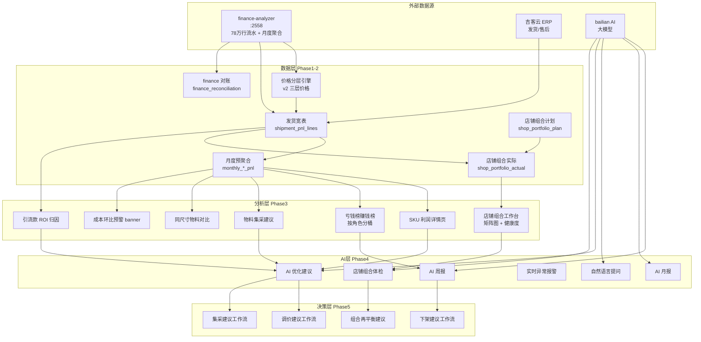
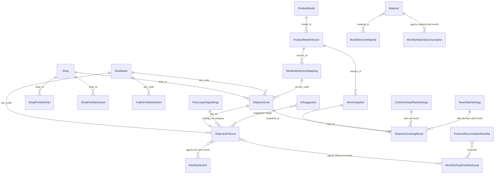

# 盈亏分析模块整体架构 v1.2

> 状态：v1.2 总图（统领其他 5 份蓝图的索引文档；2026-05-09 已采纳 Manus 外部评审；2026-05-09 17:55 v1.2 校准同步 Hub v1.3）
>
> **v1.2 关键变化（必读，2026-05-09 17:55 同步 Hub v1.3 校准）**：
> - **shipment_pnl_lines 表名废弃** → 改为复用现有 `shipment_costing_results` 表（迁移 0027 已落地，含 `cost_material_total` / `cost_process_total` / `cost_overhead_total` / `cost_total`）。"发货利润事实表"概念保留，落点改为 `shipment_costing_results.metadata_json` + 一个 SQL view 计算 GM1/GM2/NP3。
> - **Cost Rate Hub 加入总图**：v1.2 新增 cost_rate_hub_design_v1.md v1.3 作为 P2 真相文档，是 §3 数据模型 + §4 接口契约的费率源头。
> - **5 个雏形子系统纳入"已有系统关系"**：见 §1.3 修订表（LongTailCogsRateStrategy / data_quality_service / SKU 治理 4 态 / shipment_costing_results / 4 个 Insights）。
> - **强制读 system_capability_inventory.md**：本总图与该清单冲突时以清单为准；该清单 §13.1 表 U8 标记本次 v1.2 升级已完成。
>
> **v1.1 关键变化（保留，2026-05-09 上午）**：
> - **Phase 1 严格收敛为「订单利润作战室 MVP」**：只做"发货利润事实表 + 成本快照 + 三层利润 + 5 类亏损标签 + 多主体与品类费率 + finance 集成"。
> - ~~**`shipment_pnl_lines` 从 Phase 2 提到 Phase 1**~~ → **v1.2 校准：复用 `shipment_costing_results` 表，无需新建**（W2 废弃叙述）。
> - **SKU 组合矩阵 / 健康度评分 / 工作台 / 引流款 ROI 归因 / 成本优化机会榜** 全部延后到 **Phase 2-3**。
> - **AI 周报 / NLQ / 自动调价 / 自动下架** 维持 **Phase 4-5**。
> - **多主体核算 + 品类制造费率必分** 与本次收敛不冲突，仍在 Phase 1 范围内（见 `finance_analyzer_integration_v1.md §7.5`）。
>
> 关联：本文档是入口；以下文档讲细节（v1.2 新增 cost_rate_hub_design_v1.md + system_capability_inventory.md）
> - [../handovers/system_capability_inventory.md](../handovers/system_capability_inventory.md) - **v1.2 强制首读** — 系统能力清单（含 §12 文档优先级 + §13 防忘追踪）
> - [cost_rate_hub_design_v1.md](./cost_rate_hub_design_v1.md) v1.3 - **v1.2 强制次读** — Cost Rate Hub 设计（费率治理中枢，本总图 §3/§4 的费率源头）
> - [profit_and_returns_analytics_plan_2025_2026_v0_1.md](./profit_and_returns_analytics_plan_2025_2026_v0_1.md) - **PnL 项目原配蓝图**（4 个 Insights + 3 个 profit API 的源头）
> - [finance_analyzer_integration_v1.md](./finance_analyzer_integration_v1.md) - finance API 集成 + 多主体合并 + monthly_cost_variance（v1.1，待 v1.2 校准 — 见 system_capability_inventory.md §13.1 U2）
> - [sku_portfolio_management_v1.md](./sku_portfolio_management_v1.md) - SKU 角色 + 5 类亏损决策规则（v1.1，待 v1.2 校准 — 见 §13.1 U1）
> - [../manuals/guides/price_calculation_guide.md](../manuals/guides/price_calculation_guide.md) - 价格分层 v2.1 + 三层利润口径
> - [../manuals/transfer_pricing_handbook.md](../manuals/transfer_pricing_handbook.md) - 内部转移价手册（含市场线约束）
> - [../handovers/phase0_review_checklist.md](../handovers/phase0_review_checklist.md) - Phase 0 评审清单（v1.2.1，待 v1.3 校准 — 见 §13.1 U4）
> - 外部评审：`DOC/基础表单/专业版盈亏分析模块初步评审报告VI.md`（Manus AI 第 1 轮）+ 后续 4 份外部评审见 [pnl_external_reviews/INDEX.md](../handovers/pnl_external_reviews/INDEX.md)

---

## 0. 一图看全模块



---

## 1. 模块定位与边界

### 1.1 这个模块要做什么

**一句话**：把"成本核算 + 实际售价 + 产品组合 + AI"四个层面的数据穿成一个闭环，让经营者**5 秒内看到本月哪些产品/店铺真的亏钱、为什么亏、怎么处理**。

### 1.2 这个模块不做什么

- 不做单据级会计核算（属于 finance-analyzer 范畴）
- 不做库存周转/物流仓配（属于吉客云/WMS 范畴）
- 不做精细 SEO/广告投放（属于运营平台范畴）
- 不做 OKR/KPI 考核管理（属于人力系统范畴）

### 1.3 与已有系统的关系（v1.2 校准：补 5 个雏形子系统 + Cost Rate Hub）

#### 1.3.1 外部系统

| 系统 | 边界 | 数据流 |
|---|---|---|
| finance-analyzer | 财务真相（流水/科目/工资/税务） | costing 拉 → finance 反推制造费率/人工/对账 |
| 吉客云 ERP | 交易真相（发货/售后/库存） | costing 拉 → 计算订单成本/利润 |
| bailian AI | 智能引擎（大模型） | costing 调 → 生成报告/建议/对话 |
| ai-costing 自身 | 成本核算 + 利润分析 | 本模块所在 |

#### 1.3.2 ai-costing 内部已有的 5 个雏形子系统（v1.2 必须复用，禁止造轮子）

> 来源：`DOC/costing/handovers/system_capability_inventory.md` §6（5 个雏形子系统代码定位）

| 雏形子系统 | 当前能力 | PnL v1.2 复用方式 |
|---|---|---|
| **`LongTailCogsRateStrategy`**（雏形 Hub）| 4 层优先级 resolve + history audit + CRUD + UI | Phase 1 经 Hub v1.3 升级为 `cost_rate_master`（加 rate_type/scope_type），是 §3 数据模型 + §4 接口契约的费率源头 |
| **`shipment_costing_results`**（成本结果落库表）| 含 `cost_material_total` / `cost_process_total` / `cost_overhead_total` / `cost_total` | **替代 v1.1 计划的 `shipment_pnl_lines` 新表**；Phase 1 SQL view 直接 JOIN 算 GM1/GM2/NP3 |
| **`data_quality_service`**（可信度治理）| nightly + mark_only + 三色徽章雏形 | 加 `cost_quality` 维度（material/labor/overhead 三个 enum），承载本总图的"成本可信度徽章" |
| **SKU 治理 4 态状态机**（unmanaged/auto_bound/pending_model/do_not_model）| 状态机 + 长尾兜底成本 | 与成本可信度徽章对齐：auto_bound=🟢 / pending_model=🟡 / do_not_model=🔴 |
| **4 个 Insights 看板**（Profit/Shop/Sales/AfterSales）| 已上线 + 已支持时间窗 + 渠道筛选 + 覆盖率 | Phase 1 不造新看板，加成本可信度徽章 + 三视图（FI/CO/集团）切换 |

#### 1.3.3 主数据所在地（避免重复造主数据）

| 主数据 | 所在地 | 不要做的事 |
|---|---|---|
| 班组 + 默认人工费率 | `taxonomy` 表 `domain='team'` + `default_minute_rate` | 不要在 `processes` 表加 `team_id` / `default_minute_rate`（费用归集字段 `cost_center_id` 加在 processes 是合理的，不冲突）|
| 工序 + 标准费率 | `processes` 表 + `standard_rate` + `charging_mode` | 不要把 taxonomy.team 的人工费率复制过来 |
| 制造费率 | Hub `cost_rate_master`（v1.3 由 long_tail_cogs_rate_strategies 升级而来）| 不要新建 `overhead_rate_master` 表 |
| 物料价 | `materials.unit_price`（Stage 2 加 `purchase_entity_id` 等 4 字段）| 不要在 v1 Hub 里直接管物料价 |

---

## 2. 五个阶段的产出物清单

### Phase 0 - 口径文档（已完成）

- [`finance_analyzer_integration_v1.md`](./finance_analyzer_integration_v1.md) - finance 集成方案
- [`sku_portfolio_management_v1.md`](./sku_portfolio_management_v1.md) - SKU 角色 + 店铺组合
- [`../manuals/guides/price_calculation_guide.md`](../manuals/guides/price_calculation_guide.md) - 价格计算 v2
- [`../manuals/transfer_pricing_handbook.md`](../manuals/transfer_pricing_handbook.md) - 内部转移价手册
- `pnl_analytics_module_design.md` - 本文档（总图）

### Phase 1 三视图切换（v1.1 新增 / 与 `finance_analyzer_integration_v1.md §7.5.11` 同步）⭐

> 经营 / 法人 / 集团合并三个视图共享同一份 `shipment_pnl_lines` 基础数据，**没有数据复制**，仅是聚合维度不同，前端用一个 `<ViewSwitcher>` 控件切换：

| 视图 | 默认值 | 主要受众 | 聚合维度 | 是否含 `pool_group_overhead` / `pool_abnormal_strategic` |
|---|---|---|---|---|
| **经营视图 CO**（默认） | ✓ 默认 | 运营 / 老板 / 工厂厂长 | shop / business_unit / category / cost_center / sku | 否（剔除集团费用 + 异常池） |
| **法人视图 FI** | — | 财务 / 税务 / 代账会计 | legal_entity（销售法人）/ factory_legal_entity（生产法人） | 是（含全部，按发票/纳税口径） |
| **集团合并视图 Group** | — | 老板 | 全集团（内部交易抵消） | 是（含全部 + 内部交易抵消） |

> **关键纪律**：5 类亏损决策规则 + 砍 SKU 决策**只在经营视图（CO）下生效**——法人视图的负 GM1 可能只是"开票法人变了导致归属变了"，不能用来判断 SKU 是否要砍。

### Phase 1 — 订单利润作战室 MVP（v1.1 严格收敛后）

> **目标（一句话）**：每条发货数据进来后，系统自动算出 SKU/产品/材质/店铺/工厂的标准成本、实收、三层利润、亏损标签，并锁成本快照保证历史可重现。
> **不在 Phase 1 的事**（明确延后）：SKU 组合矩阵 / 健康度评分 / 工作台 / 引流款 ROI 归因 / 成本优化机会榜 / 调价建议 / 下架工作流。

| 产出物 | 类型 | 路径 | 备注 |
|---|---|---|---|
| **finance_client** | Python module | `backend/src/integrations/finance_analyzer/client.py` | 7 法人维度 |
| **OverheadRateService（按 BU × 品类）** | Python service | `backend/src/planner/services/overhead_rate_service.py` | 输出 `category_overhead_rate_history` |
| **TeamRateService（全口径 + 按归属分摊）** | Python service | `backend/src/planner/services/team_rate_service.py` | 配 `employee_attribution` |
| **AllocationService** | Python service | `backend/src/planner/services/allocation_service.py` | 跨法人共享开支按 `cost_allocation_rule` 分摊 |
| **PriceLayeringService** | Python service | `backend/src/planner/services/price_layering_service.py` | 8 个价格层 |
| **ShipmentPnlComputeService** ⭐ | Python service | `backend/src/planner/services/shipment_pnl_compute_service.py` | **核心服务，三层利润 + 5 类亏损标签** |
| **CostSnapshotService** ⭐ | Python service | `backend/src/planner/services/cost_snapshot_service.py` | 锁版本，历史可重现 |
| `legal_entity` / `business_unit` / `shop_master` 表 | DB schema | alembic migration | 详见 `finance_analyzer_integration_v1.md §7.5` |
| `employee_attribution` 表 | DB schema | alembic migration | 同上 |
| `cost_allocation_rule` 表 | DB schema | alembic migration | 同上 |
| `category_overhead_rate_history` 表 | DB schema | alembic migration | 替代原 `cost_overhead_rate_settings` |
| `team_rate_history` 表 | DB schema | alembic migration | 月度落库 |
| `price_layering_settings` 表 | DB schema | alembic migration | 三层价格参数 |
| `Material.roll_width_mm` + `allow_rotate` | DB 字段 | alembic migration | `allow_rotate` Phase 1 仅入库不消费 |
| `CalculationMethod.area_with_cutting` | Enum | `backend/src/planner/schemas.py` | "标准下料占用面积"口径 |
| `SkuMaster.sku_role` + `loss_budget_role` | DB 字段 | alembic migration | 5 类角色仅打标签，不做组合矩阵 |
| `ShipmentLine` 升级（shop_id + 5 字段：实收/优惠/平台扣点/广告分摊/退款/运费） | DB 字段 | alembic migration | jackyun mapper 同步升级 |
| **`shipment_pnl_lines` 表 ⭐** | DB schema | alembic migration | **MVP 底座，字段见 §3.3** |
| **`cost_snapshot` 表 ⭐** | DB schema | alembic migration | 物料/人工/制造费快照，按 `snapshot_id` 引用 |
| pnl worker 实时触发 | Python | `backend/src/planner/services/shipment_import_worker.py` | 发货进来 → 计算 pnl_line |
| 计算汇总组件升级（8 价格层 + 三层利润预览） | UI | `frontend/src/components/costing/ProductModelEditorDrawer.tsx` | |
| 物料编辑页幅宽字段 | UI | `frontend/src/pages/costing/MaterialMasterPage.tsx` | |
| **赚钱榜 / 亏钱榜（最简版）** ⭐ | React 页面 | `frontend/src/pages/costing/PnlLeaderboardPage.tsx` | **只看 GM1 排序 + 5 类亏损标签**，不含矩阵图；顶部带三视图切换 |
| **SKU 利润详情页（最简版）** ⭐ | React 页面 | `frontend/src/pages/costing/SkuProfitDetailPage.tsx` | 单 SKU 三层利润 + 成本结构瀑布；顶部带三视图切换 |
| **`<ViewSwitcher>` 视图切换控件** ⭐ | React 组件 | `frontend/src/components/common/PnlViewSwitcher.tsx` | 经营/法人/集团合并 三视图切换 |
| **`cost_center` + `work_team` 主数据表** ⭐ | DB schema | alembic migration | 详见 `finance_analyzer_integration_v1.md §7.5.10` |
| `cost_pool_master` + 4 个费用池数据 | DB schema | alembic migration | 详见 `finance_analyzer_integration_v1.md §7.5.4·b` |
| `category_overhead_rate_history` 升级（加 `rate_type`） | DB schema | alembic migration | 拆 variable / fixed |
| 月度费率 cron 脚本 | Script | `backend/scripts/sync_monthly_overhead_rate.py` | 按 BU × 品类 |
| finance API 健康检查 endpoint | API | `backend/src/planner/routers/integrations.py` | |
| 历史 3 个月数据回灌脚本（最近 3 个月即可） | Script | `backend/scripts/backfill_pnl_lines.py` | 老板能看出"最近赚钱情况" |

### Phase 2 — 月度对账 + 差异分摊 + 成本优化机会榜

| 产出物 | 类型 | 路径 | 备注 |
|---|---|---|---|
| `monthly_sku_pnl` / `monthly_model_pnl` / `monthly_shop_pnl` 等预聚合表 | DB schema | alembic migration | 性能优化 |
| `monthly_cost_variance` 表 ⭐ | DB schema | alembic migration | **标准 vs 实际差异分摊**（详见 finance §8） |
| 月度重算脚本 | Script | `backend/scripts/recompute_monthly_pnl.py` | |
| `finance_reconciliation_monthly` 表 | DB schema | alembic migration | |
| 月度对账 cron | Script | `backend/scripts/run_monthly_reconciliation.py` | |
| **`cost_optimization_opportunities` 表 ⭐** | DB schema | alembic migration | **可节省金额排序的优化机会** |
| **成本优化机会榜页面** | React 页面 | `frontend/src/pages/costing/CostOptimizationPage.tsx` | 按 "可节省金额 / 月" 排序 |
| 物料集采建议页 | React 页面 | `frontend/src/pages/costing/MaterialProcurementPage.tsx` | |
| 同尺寸物料对比页 | React 页面 | `frontend/src/pages/costing/SizeMaterialComparePage.tsx` | |
| 成本环比预警 banner / 财务对账 banner | React 组件 | 嵌入 `SalesInsightsPage.tsx` | |
| `GET /reconciliation/monthly` / `GET /cost-optimization/opportunities` API | API | 新建 router | |
| `Material.allow_rotate` 真正消费（旋转后取 min 占用） | Python | 升级 `area_with_cutting` 算法 | |

### Phase 3 — 店铺组合工作台 + SKU 组合矩阵

> 这一阶段的所有内容**等到 `shipment_pnl_lines` 跑稳 1-2 个月、运营和老板都看出哪些 SKU 真亏哪些是引流款之后** 再做。

| 产出物 | 类型 | 路径 |
|---|---|---|
| `shop_portfolio_plans` / `shop_portfolio_actuals` / `monthly_shop_portfolio_actual` 表 | DB schema | alembic migration |
| `traffic_profit_attributions` 表 | DB schema | alembic migration |
| 店铺组合工作台 | React 页面 | `frontend/src/pages/costing/ShopPortfolioWorkbenchPage.tsx`（新建） |
| 引流款 ROI 归因页 | React 页面 | `frontend/src/pages/costing/TrafficAttributionPage.tsx`（新建） |
| 散点矩阵图组件 | React 组件 | `frontend/src/components/charts/PortfolioMatrix.tsx`（新建） |
| 健康度仪表组件 | React 组件 | `frontend/src/components/charts/HealthGauge.tsx`（新建） |
| 组合影响评估弹窗 | React 组件 | `frontend/src/components/dialogs/OffshelfImpactDialog.tsx`（新建） |
| AI 角色推荐 API | API | `backend/src/planner/routers/skus.py` |
| `POST /shops/{id}/portfolio-plan` 等 API | API | `backend/src/planner/routers/shops.py`（新建） |
| 售价瀑布图组件 | React 组件 | `frontend/src/components/charts/PriceWaterfall.tsx`（新建） |

### Phase 4 - AI 智能分析引擎

| 产出物 | 类型 | 路径 |
|---|---|---|
| AI 周报生成器 | Python service | `backend/src/planner/services/ai_weekly_report.py`（新建） |
| AI 月报生成器 | Python service | `backend/src/planner/services/ai_monthly_report.py`（新建） |
| AI NLQ 服务 | Python service | `backend/src/planner/services/ai_nlq_service.py`（新建） |
| AI 异常报警 | Python service | `backend/src/planner/services/ai_anomaly_service.py`（新建） |
| AI 优化建议引擎 | Python service | `backend/src/planner/services/ai_optimization_service.py`（新建） |
| AI 店铺组合体检 | Python service | `backend/src/planner/services/ai_portfolio_check.py`（新建） |
| ai_suggestions 表 | DB schema | alembic migration |
| ai_reports 表 | DB schema | alembic migration |
| AI chat 抽屉组件 | React 组件 | `frontend/src/components/ai/ProfitChatDrawer.tsx`（新建） |
| AI 报告查看页 | React 页面 | `frontend/src/pages/costing/AiReportsPage.tsx`（新建） |
| 周报/月报 cron 脚本 | Script | `backend/scripts/generate_ai_reports.py`（新建） |

### Phase 5（可选）- 决策工作流

| 产出物 | 类型 | 路径 |
|---|---|---|
| 下架建议工作流 | Python service + UI | TBD |
| 调价建议工作流 | Python service + UI | TBD |
| 集采询价单 PDF 生成 | Python service | TBD |
| 组合再平衡建议工作流 | Python service + UI | TBD |

---

## 3. 数据模型总图

### 3.1 实体关系图（ER）



### 3.2 关键表清单（按 Phase 排序，v1.1 收敛后）

| Phase | 新增/升级表 | 主要用途 |
|---|---|---|
| 1 | `legal_entity` / `business_unit` / `shop_master` | 多主体三层模型 |
| 1 | `cost_center` / `work_team` ⭐ | 成本中心与班组主数据（v1.1 新增） |
| 1 | `cost_pool_master` ⭐ | 4 个固定费用池（v1.1 新增） |
| 1 | `employee_attribution` | 员工服务对象归属（人工分摊） |
| 1 | `cost_allocation_rule`（含 `pool_id`） | 跨法人共享开支分摊规则（强制带池） |
| 1 | `category_overhead_rate_history`（含 `rate_type`） | 月度 BU × 品类 × variable/fixed 制造费率 |
| 1 | `team_rate_history` | 月度班组单价（全口径 + 归属分摊） |
| 1 | `price_layering_settings` | 三层价格参数 |
| 1 | `sku_master`（升级） | 增加 `sku_role` / `loss_budget_role` |
| 1 | `materials`（升级） | 增加 `roll_width_mm` / `allow_rotate` |
| 1 | `shipment_lines`（升级，1 次到位） | shop_id + 实收/优惠/平台扣点/广告分摊/退款/运费 6 字段 |
| 1 | **`shipment_pnl_lines` ⭐** | **盈亏事实表（详见 §3.3）** |
| 1 | **`cost_snapshot` ⭐** | 物料/人工/制造费快照 |
| 2 | `monthly_sku_pnl` / `monthly_model_pnl` / `monthly_shop_pnl` | 月度预聚合 |
| 2 | `monthly_material_consumption` | 月度物料消耗 |
| 2 | `monthly_cost_variance` ⭐ | 标准 vs 实际差异分摊 |
| 2 | `finance_reconciliation_monthly` | 月度财务对账 |
| 2 | `cost_optimization_opportunities` ⭐ | 成本优化机会榜（按可节省金额排序） |
| 3 | `shop_portfolio_plans` / `shop_portfolio_actuals` | 店铺组合计划 / 实际 |
| 3 | `monthly_shop_portfolio_actual` | 月度店铺组合 |
| 3 | `traffic_profit_attributions` | 引流款 ROI 归因 |
| 4 | `ai_suggestions` / `ai_reports` | AI 建议 + 周报/月报 |

### 3.3 ~~`shipment_pnl_lines` 字段定义~~ → **v1.2 校准：复用 `shipment_costing_results` 表 + SQL view**

> **⚠️ v1.2 关键校准（2026-05-09 17:55）**：
>
> 本节 v1.1 设计的"新建 `shipment_pnl_lines` 表"叙述已废弃（W2，详见 `system_capability_inventory.md` §12.3）。原因：现有 `shipment_costing_results` 表（迁移 0027）已经在产 `cost_material_total` / `cost_process_total` / `cost_overhead_total` / `cost_total` 三段成本数据。
>
> **v1.2 实际方案**：
> 1. **不新建表** — Phase 1 复用 `shipment_costing_results`
> 2. **SQL view 算盈亏** — 创建 `v_shipment_pnl_lines` view，JOIN `shipment_lines` + `shipment_costing_results` + `cost_rate_master`（Hub v1.3 升级而来），按下方字段定义计算 GM1/GM2/NP3 + 5 类亏损标签
> 3. **冷热分离** — 月度归档时把 view 物化为 `monthly_shipment_pnl_lines` 分区表，热查询走 view，冷分析走分区
> 4. **成本快照锁定** — 复用 `shipment_costing_results.metadata_json.kind` 标记 + 加 `cost_quality` 嵌套对象（含 rate 来源 + trust_level + sku_governance_status）
>
> **下方原 v1.1 字段定义保留作为"逻辑模型"**，是 view 的字段映射参考。任何 Backend Agent 实施时，必须按 v1.2 实际方案落地（建 view 而非建表）。

> **AKA**：发货利润事实表 / shipment_profit_fact（v1.1 命名沿用以兼容现有计划，v1.2 落地为 view）。
> **核心约束**：每条发货明细 → 1 条 pnl line（view 的一行）；**必须锁 `cost_snapshot_id`**（`shipment_costing_results.metadata_json` 已记录），历史不被今天的成本参数变化污染。

```sql
CREATE TABLE shipment_pnl_lines (
  -- 主键 / 关联
  id BIGSERIAL PRIMARY KEY,
  shipment_line_id BIGINT NOT NULL UNIQUE REFERENCES shipment_lines(id),
  cost_snapshot_id BIGINT NOT NULL REFERENCES cost_snapshot(id),

  -- 交易维度（用于多维聚合）
  shop_id INT NOT NULL,
  business_unit VARCHAR(32) NOT NULL,
  legal_entity VARCHAR(32) NOT NULL,           -- 销售开票法人（运营侧）
  factory_legal_entity VARCHAR(32),            -- v1.1 新增：实际生产法人（工厂侧，可能 ≠ 销售法人）
  cost_center_id VARCHAR(32),                  -- v1.1 新增：归集到哪个成本中心
  work_team_id VARCHAR(32),                    -- v1.1 新增：哪个班组生产
  sku_code VARCHAR(64) NOT NULL,
  product_model_id BIGINT,
  category VARCHAR(32) NOT NULL,           -- 'home_decor' / 'home_textile'
  material_main VARCHAR(64),
  size_spec VARCHAR(32),
  qty DECIMAL(12,3) NOT NULL,
  shipped_at DATE NOT NULL,
  year_month DATE NOT NULL,                -- 'YYYY-MM-01'，分区键

  -- 收入侧（必须用实收，禁止用挂牌价）
  revenue_listed DECIMAL(12,2),            -- 挂牌价 × 数量（参考）
  revenue_actual DECIMAL(12,2) NOT NULL,   -- 实付（含运费收入）
  discount_amount DECIMAL(12,2) NOT NULL DEFAULT 0,
  freight_income DECIMAL(12,2) NOT NULL DEFAULT 0,
  refund_amount DECIMAL(12,2) NOT NULL DEFAULT 0,
  revenue_net DECIMAL(12,2) NOT NULL,      -- 净收入 = 实付 - 退款

  -- 成本侧（按快照口径）
  cost_material_main DECIMAL(12,2) NOT NULL,
  cost_material_aux DECIMAL(12,2) NOT NULL DEFAULT 0,
  cost_packaging DECIMAL(12,2) NOT NULL DEFAULT 0,
  cost_labor_direct DECIMAL(12,2) NOT NULL,
  cost_overhead_variable DECIMAL(12,2) NOT NULL DEFAULT 0,
  cost_overhead_fixed_alloc DECIMAL(12,2) NOT NULL DEFAULT 0,
  cost_management_alloc DECIMAL(12,2) NOT NULL DEFAULT 0,

  -- 运营费用
  freight_outbound DECIMAL(12,2) NOT NULL DEFAULT 0,
  platform_fee_direct DECIMAL(12,2) NOT NULL DEFAULT 0,
  payment_fee DECIMAL(12,2) NOT NULL DEFAULT 0,
  ad_alloc DECIMAL(12,2) NOT NULL DEFAULT 0,
  commission DECIMAL(12,2) NOT NULL DEFAULT 0,
  freight_insurance DECIMAL(12,2) NOT NULL DEFAULT 0,
  refund_provision DECIMAL(12,2) NOT NULL DEFAULT 0,

  -- 三层利润 ⭐
  gross_margin_1 DECIMAL(12,2) NOT NULL,   -- 贡献毛利一
  gross_margin_2 DECIMAL(12,2) NOT NULL,   -- 经营毛利二
  net_profit_3 DECIMAL(12,2) NOT NULL,     -- 全成本利润三
  gm1_rate DECIMAL(6,4),                   -- GM1 率（%）
  gm2_rate DECIMAL(6,4),
  np3_rate DECIMAL(6,4),

  -- 5 类亏损分类标签 ⭐
  loss_classification VARCHAR(24),         -- 'true_loss' / 'op_loss' / 'fullcost_loss' / 'traffic_loss' / 'data_anomaly' / 'profit'

  -- 数据质量与可追溯 ⭐
  costing_method VARCHAR(32) NOT NULL,     -- 'standard' / 'area_with_cutting' / 'manual_override'
  data_quality_tag VARCHAR(64),            -- 多标签：'price_missing,freight_missing'
  is_manual_override BOOLEAN NOT NULL DEFAULT false,
  override_reason TEXT,
  override_by VARCHAR(32),

  computed_at TIMESTAMP NOT NULL,
  recomputed_count INT NOT NULL DEFAULT 0,

  CHECK (qty > 0),
  CHECK (loss_classification IN ('true_loss','op_loss','fullcost_loss','traffic_loss','data_anomaly','profit'))
);
CREATE INDEX idx_pnl_ym ON shipment_pnl_lines(year_month);
CREATE INDEX idx_pnl_sku_ym ON shipment_pnl_lines(sku_code, year_month);
CREATE INDEX idx_pnl_shop_ym ON shipment_pnl_lines(shop_id, year_month);
CREATE INDEX idx_pnl_loss ON shipment_pnl_lines(loss_classification, year_month);
CREATE INDEX idx_pnl_legal_ym ON shipment_pnl_lines(legal_entity, year_month);  -- v1.1 法人税务视图
CREATE INDEX idx_pnl_cc_ym ON shipment_pnl_lines(cost_center_id, year_month);   -- v1.1 成本中心维度
CREATE INDEX idx_pnl_team_ym ON shipment_pnl_lines(work_team_id, year_month);   -- v1.1 班组维度
```

> **v1.1 字段补充说明（已采纳第二轮外部评审）**：
> - `legal_entity` = **销售开票法人**（运营侧，决定开票主体和增值税口径）；
> - `factory_legal_entity` = **实际生产法人**（工厂侧，可能 ≠ 销售法人，用于工厂效率核算）；
> - 销售法人和生产法人**之间的内部交易**在 `transfer_pricing_handbook.md` 的转移价机制下结算，集团合并视图自动抵消；
> - `cost_center_id` 和 `work_team_id` 与 `cost_center` / `work_team` 主数据表外键关联（详见 `finance_analyzer_integration_v1.md §7.5.10`）。

### 3.4 `cost_snapshot` 字段定义 ⭐（Phase 1 必须实现）

```sql
CREATE TABLE cost_snapshot (
  id BIGSERIAL PRIMARY KEY,
  -- 触发 / 范围
  sku_code VARCHAR(64) NOT NULL,
  product_model_version_id BIGINT,
  business_unit VARCHAR(32) NOT NULL,
  category VARCHAR(32) NOT NULL,
  effective_at TIMESTAMP NOT NULL,         -- 这个快照适用于"何时之后的发货"
  -- 锁定的版本号
  material_price_version VARCHAR(32) NOT NULL,
  labor_rate_version VARCHAR(32) NOT NULL,    -- 'team_rate_history@2026-04'
  overhead_rate_version VARCHAR(32) NOT NULL, -- 'category_overhead@2026-04@home_textile'
  costing_method VARCHAR(32) NOT NULL,
  bom_snapshot_id BIGINT,                  -- 关联 BomSnapshot
  -- 计算结果（标准成本快照）
  cost_material_main DECIMAL(12,4) NOT NULL,
  cost_material_aux DECIMAL(12,4),
  cost_packaging DECIMAL(12,4),
  cost_labor_direct DECIMAL(12,4) NOT NULL,
  cost_overhead_total DECIMAL(12,4) NOT NULL,
  cost_overhead_variable DECIMAL(12,4),
  cost_overhead_fixed DECIMAL(12,4),
  -- 计算原料明细（JSON）
  material_breakdown JSONB,
  labor_breakdown JSONB,
  -- 创建追踪
  created_at TIMESTAMP NOT NULL DEFAULT now(),
  created_by VARCHAR(32) NOT NULL DEFAULT 'system',
  is_manual_override BOOLEAN NOT NULL DEFAULT false,
  override_reason TEXT,
  UNIQUE(sku_code, effective_at)
);
CREATE INDEX idx_snapshot_sku_eff ON cost_snapshot(sku_code, effective_at);
```

### 3.5 5 类亏损分类决策规则 ⭐

| `loss_classification` | 触发条件 | 建议动作 |
|---|---|---|
| `true_loss` 真亏损 | GM1 < 0 且近 30 天销量 ≥ 最低样本量 | 立即涨价 / 替换材料 / 优化工艺 / 下架 |
| `op_loss` 运营亏损 | GM1 ≥ 0 且 GM2 < 0 | 检查广告投放 / 平台活动 / 退款补贴 |
| `fullcost_loss` 全成本亏损 | GM2 ≥ 0 且 NP3 < 0 | **不直接下架**，先看产能利用率与固定费用结构 |
| `traffic_loss` 引流款亏损 | GM1 < 0 且 `sku_role = traffic` | 计入"引流亏损池预算"；超预算才报警 |
| `data_anomaly` 数据异常 | 任一关键字段缺失（售价/成本/运费/退款/材质） | **不进决策**，只进数据修复任务 |
| `profit` 盈利 | GM1 ≥ 0 且 GM2 ≥ 0 | 持续观察 |

> 详见 `sku_portfolio_management_v1.md §X` 的"5 类亏损 SKU 决策规则"完整版。

---

## 4. 接口契约

### 4.1 总体规范

- 前缀：`/api/planner`（与现有保持一致）
- 鉴权：`require_staff_role`（已有，不变）
- 错误码：参照现有 `error_handlers.py`
- 分页：`page` + `page_size`，最大 200

### 4.2 新增 endpoint 清单（按模块分组）

#### finance 集成（Phase 1）

```text
GET  /api/planner/integrations/finance-analyzer/health
GET  /api/planner/cost-overhead-rates?year_month=YYYY-MM&category=...
POST /api/planner/cost-overhead-rates/sync          # 手动触发反推
GET  /api/planner/team-rates?year_month=YYYY-MM&team=...
POST /api/planner/team-rates/sync
GET  /api/planner/price-layering-settings?category=...
POST /api/planner/price-layering-settings
```

#### SKU 角色与店铺（Phase 1+2）

```text
POST /api/planner/skus/{sku_code}/role
GET  /api/planner/skus/{sku_code}/role
POST /api/planner/skus/role/batch-assign
POST /api/planner/skus/role/ai-recommend
GET  /api/planner/shops?active=true&platform=...
POST /api/planner/shops
GET  /api/planner/shops/{shop_id}/portfolio-plan?year_month=YYYY-MM
POST /api/planner/shops/{shop_id}/portfolio-plan
GET  /api/planner/shops/{shop_id}/portfolio-actual?year_month=YYYY-MM
GET  /api/planner/shops/{shop_id}/portfolio-actual/timeseries
GET  /api/planner/shops/{shop_id}/health-score
GET  /api/planner/shops/{shop_id}/portfolio-matrix
POST /api/planner/shops/{shop_id}/offshelf-impact-analysis
```

#### 盈亏分析（Phase 2-3）

```text
GET  /api/planner/pnl/sku/{sku_code}?year_month=YYYY-MM
GET  /api/planner/pnl/sku/{sku_code}/timeseries
GET  /api/planner/pnl/leaderboard?type=loss|profit&dimension=sku|model|category|shop
GET  /api/planner/pnl/leaderboard/by-role?role=traffic|profit|brand
GET  /api/planner/material-procurement/topn?year_month=YYYY-MM
GET  /api/planner/size-material-compare?category=...&size=...
GET  /api/planner/cost-anomaly?period=...
```

#### 引流款归因（Phase 3）

```text
GET  /api/planner/traffic-attribution?shop_id=...&year_month=YYYY-MM
GET  /api/planner/traffic-attribution/leaderboard?shop_id=...
POST /api/planner/traffic-attribution/recompute
```

#### 财务对账（Phase 2）

```text
GET  /api/planner/reconciliation/monthly?year_month=YYYY-MM
POST /api/planner/reconciliation/run
GET  /api/planner/reconciliation/{id}/details
```

#### AI（Phase 4）

```text
POST /api/planner/ai/profit-qa                     # 自然语言提问
POST /api/planner/ai/sku-diagnose/{sku_code}       # 单 SKU 诊断
POST /api/planner/ai/shop-health-check/{shop_id}   # 店铺组合体检
GET  /api/planner/ai/reports?type=weekly|monthly
GET  /api/planner/ai/reports/{report_id}
GET  /api/planner/ai/suggestions?status=pending|accepted|rejected
POST /api/planner/ai/suggestions/{id}/accept
POST /api/planner/ai/suggestions/{id}/reject
```

---

## 5. AI 引擎设计

### 5.1 核心设计原则

1. **结构化输入**：不喂大段文本给 LLM，先把数据聚合成结构化 JSON 再传 prompt
2. **固定输出模板**：每个场景的输出格式固定（结论+原因+建议+影响+风险）
3. **可追溯**：每条 AI 建议必须能追到原始数据
4. **可采纳追踪**：建议落库 `ai_suggestions`，支持 accept/reject 反馈，用于 A/B 改进

### 5.2 prompt 模板示例

#### AI 周报模板

```text
[System]
你是一位专业的电商运营顾问，专长于分析中小品牌的店铺盈亏。
请基于以下结构化数据，按"按角色分块"的方式生成本周分析报告。
要求：
1. 每个发现必须带具体数据
2. 每条建议必须可执行（指定操作 + 验收标准）
3. 区分"引流款合理亏损"和"真亏损"
4. 不要废话，直接给结论和建议

[User]
店铺：{shop_name}
本周时间：{date_from} 到 {date_to}

【店铺组合计划】
{portfolio_plan_json}

【店铺组合实际】
{portfolio_actual_json}

【引流款 SKU 详情】
{traffic_skus_metrics_json}

【利润款 SKU 详情】
{profit_skus_metrics_json}

【形象款 SKU 详情】
{brand_skus_metrics_json}

【上周对比】
{week_over_week_json}

请输出本周分析报告。
```

#### AI 单 SKU 诊断模板

```text
[System]
你是一位电商盈利诊断专家。请基于单 SKU 数据，分析其盈利状况，给出具体可执行的优化建议。
建议必须按以下三类输出：
1. 立即可做的（本周内）
2. 中期优化（1 个月内）
3. 长期改造（3 个月内）

[User]
SKU 代码：{sku_code}
SKU 角色：{sku_role}
角色目标毛利率：{role_target_margin}

【SKU 基础信息】
{sku_master_json}

【最近 30 天盈亏】
{pnl_30days_json}

【成本结构】
{cost_breakdown_json}

【同模型其他 SKU 对比】
{same_model_skus_json}

【同尺寸不同物料对比】
{same_size_alternatives_json}

请诊断并给出建议。
```

### 5.3 异常检测规则

实时异常检测每小时跑一次，规则化为主、AI 验证为辅：

| 异常类型 | 触发规则 | AI 验证 |
|---|---|---|
| 成本暴涨 | 单 SKU 月环比成本上涨 > 20% | AI 找原因（哪项物料涨价） |
| 毛利暴跌 | 单 SKU 月环比毛利下降 > 10pct | AI 找原因（售价降 vs 成本涨） |
| 销量异常 | 单 SKU 日销量 > 历史 7 日均值 × 3 | AI 找原因（活动 vs 自然增长） |
| 退货率突增 | SKU 周退货率 > 历史 4 周均值 × 1.5 | AI 找原因（质量 vs 描述不符） |
| 引流亏损池超支 | 任一店铺引流款亏损 > 预算 80% | AI 给替换建议 |
| 组合占比变化 | 任一店铺角色占比月内变化 > 15% | AI 评估是否健康 |

---

## 6. 性能与可扩展性

### 6.1 性能目标

| 操作 | 目标响应时间 |
|---|---|
| SKU 利润详情页加载 | < 500ms |
| 亏钱榜/赚钱榜列表（100 条） | < 800ms |
| 店铺组合工作台（散点图 + 健康度） | < 1s |
| AI 自然语言问答 | < 8s（首字节 < 2s 用流式） |
| 月度对账（全量） | < 60s |
| 月度数据重算（最近 3 个月） | < 5min（cron 离线） |

### 6.2 扩展性设计

- **数据量预估**：100 万 SKU + 100 万订单/月 = 1200 万订单/年
- **预聚合策略**：所有查询走 `monthly_*` 预聚合表，原始 `shipment_pnl_lines` 仅用于详情页
- **分区策略**：`shipment_pnl_lines` 按 `year_month` 分区，老数据自动归档
- **缓存策略**：热点数据（本月 + 上月）走 Redis；冷数据走 DB

### 6.3 监控指标（接 Prometheus）

```text
# 业务指标
costing_pnl_daily_records_total       # 每日生成的盈亏记录数
costing_recon_diff_pct{type='revenue|cost|margin'}  # 月度对账差异
costing_health_score_avg              # 平均店铺健康度
costing_traffic_pool_used_pct         # 引流亏损池消耗率

# 技术指标
finance_api_requests_total{endpoint, status}
finance_api_request_duration_seconds_bucket
ai_request_total{service, status}
ai_request_duration_seconds_bucket
pnl_recompute_duration_seconds        # 月度重算耗时
```

---

## 7. 风险与对应（汇总）

> 详细风险见各子蓝图，本节为汇总。

| 风险 | 出处 | 应对 |
|---|---|---|
| finance 生产库 schema 与本地不一致 | finance_integration | Phase 0 评审时确认 DATABASE_URL |
| 制造费率反推不准（科目分类） | finance_integration | Phase 0 与代账会计对齐 |
| 历史数据回灌运费/退货失败率高 | pnl_module | 5% 容忍，超过则打 data_incomplete 标签 |
| 运营给 SKU 角色打标慢 | portfolio_management | AI 推荐+人工复核 |
| 引流款 ROI 归因不准 | portfolio_management | v1 用 naive_baseline，v2 接平台 API |
| AI 周报/月报废话多 | pnl_module | 第 1 周人工 review 后才发出 |
| 价格分层参数失误导致工厂亏损/运营压价 | transfer_pricing | 月度调节系数 + 双签锁定 |
| 多公司分摊规则变化 | finance_integration | 通过 finance API 动态获取 |

---

## 8. 上线检查清单（Phase 1 前必须，v1.1 更新）

### 8.1 数据层

- [ ] finance API 健康检查通过
- [ ] finance 生产库 `ledger_monthly_summaries` 已按法人维度可查
- [ ] finance 颁发服务账号 token
- [ ] 数据库迁移脚本通过 staging 环境测试
- [ ] 历史 3 个月数据回灌脚本干跑成功
- [ ] **`shipment_costing_results` 已含三段成本数据（迁移 0027 已落地，v1.2 校准复用此表）** + `v_shipment_pnl_lines` SQL view 通过 staging 测试 ⭐
- [ ] **`cost_rate_master` 表（v1.3 由 long_tail_cogs_rate_strategies 升级）+ Migration 0038 在 staging 通过** ⭐
- [ ] **抽 100 单真实发货端到端跑通：发货 → costing_result → view 计算 → 三层利润 → 5 类亏损标签** ⭐
- [ ] **Hub Tab 1（费率总览）+ Tab 2（费率编辑器）在 LongTailCogsRatePage 上扩展并通过 staging 测试** ⭐

### 8.2 业务层

- [ ] 6 个核心决策签字（详见 `phase0_review_checklist.md`）
- [ ] finance 团队签字（API 契约 + 按法人维度导出能力）
- [ ] 老板批准内部转移价机制 + 市场线约束（高于同行报警）
- [ ] 法人 → BU 映射 + `cost_allocation_rule` 首批规则财务 + 老板双签
- [ ] HR 提交 `employee_attribution` 全员归属初稿
- [ ] **三方现场看 10 单 pnl_line 抽样，确认字段口径无误** ⭐

### 8.3 技术层

- [ ] 监控指标接入 Prometheus
- [ ] 钉钉/企微告警通道测试通过
- [ ] 灰度发布方案（先在一个店铺试用 1 周）
- [ ] 回滚方案（feature flag）
- [ ] 文档更新到最新

---

## 9. 评审签字

| 角色 | 签字人 | 日期 | 备注 |
|---|---|---|---|
| 业务负责人 | | | 确认整体路线图 |
| 数据/技术负责人 | | | 确认数据模型 + API 契约 |
| 老板 | | | 确认资源投入与节奏 |
| 项目经理 | | | 确认排期可控 |

---

*文档版本：v1.1（2026-05-09 已采纳 Manus 外部评审 → Phase 1 严格收敛为"订单利润作战室 MVP"）*
*创建日期：2026-05-08*
*下次评审：Phase 1 上线前再过一次 + 每个 Phase 完成时复盘*
*外部评审录档：`DOC/基础表单/专业版盈亏分析模块初步评审报告VI.md`*
