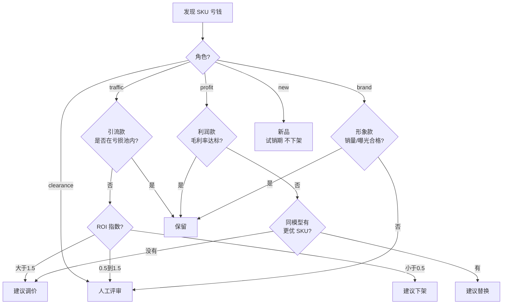

# SKU 角色与店铺组合管理蓝图 v1.1

> 状态：v1.1（2026-05-09 已采纳 Manus 外部评审 → Phase 1 严格收敛）
> 上游 PRD：[DOC/costing/product_prd/store_insights_mvp.md](../product_prd/store_insights_mvp.md)
> 关联：`pnl_analytics_module_design.md` v1.1（总图）
> 作者：Costing System Architect
>
> **v1.1 关键变化（必读）**：
> - **Phase 1 只做最小集**：5 类角色枚举字段 + AI 推荐 + 5 类亏损决策规则（§1.4 新增）即可。
> - **延后到 Phase 3**：店铺组合健康度评分（§5）、下架决策工作流（§6）、引流款 ROI 归因详细模块（§4 完整版）。
> - **Phase 1 中"引流款亏损池"只做最简版**：在 SKU 主数据上挂 `sku_role + loss_budget_role`，不做月度预算池/扣减/告警工作流。

---

## 0. 摘要

`store_insights_mvp.md` 已经把"店铺月度经营策略"的核心方法论想清楚了，但**全在前端 localStorage 试算，没落库**——本蓝图把它升级为可落地的数据模型 + 后端服务 + 决策流程，解决以下核心问题：

1. **不再"亏钱就砍"**：引流款负毛利可能是策略性的（在亏损池预算内合理）；利润款不达标才是真问题
2. **店铺整体观**：单 SKU 毛利不重要，店铺**加权毛利率 + 组合健康度**才重要
3. **可落地**：从前端原型升级为后端表 + 服务 + API + 仪表盘，运营修改后能保存
4. **可决策**：下架/调价/集采决策必须经过"组合影响评估"，不能凭单 SKU 数字一刀切

---

## 1. 五种 SKU 角色定义

### 1.1 完整角色矩阵

| 角色 | 中文名 | 英文枚举 | 战略定位 | 典型特征 | 目标毛利率 | 评估口径 |
|---|---|---|---|---|---|---|
| 引流款 | 引流款 | `traffic` | 用低价吸引流量到店铺 | 价格低于市场均价 20%+、月销量 TOP 20%、加购/收藏率高 | -10% ~ +10%（**允许亏损**） | "在亏损池预算内"+ ROI 指数 |
| 利润款 | 利润款 | `profit` | 主力变现，店铺现金牛 | 价格中等、销量稳定、复购率高 | 30%-50%（**必须达标**） | "毛利率 ≥ 角色目标" |
| 形象款 | 形象款 | `brand` | 高端定位，撑起品牌格调 | 高客单、低销量、高质感物料 | 40%+ 或不计 | "销量 > 阈值 + 流量贡献" |
| 清仓款 | 清仓款 | `clearance` | 库存处理，止损为主 | 老款、断码、季末 | -20% ~ +5% | "库存周转 + 现金回收速度" |
| 新品 | 新品 | `new` | 试销期，看 PMF | 上架 < 90 天 | 不评估，先看销量 | "动销率 + 用户反馈" |

### 1.2 角色判定规则（AI 推荐用）

当运营没主动打标时，AI 按以下规则推荐初始角色：

```python
def recommend_sku_role(sku_metrics):
    # 上架 < 90 天 → 一律新品
    if sku_metrics.days_on_shelf < 90:
        return "new"
    
    # 库存周转 < 30 天 + 价格低于历史 30%+ → 清仓款
    if sku_metrics.inventory_turnover_days > 90 and sku_metrics.price_drop_pct > 0.30:
        return "clearance"
    
    # 销量 TOP 20% + 价格低于品类均价 20%+ → 引流款
    if (sku_metrics.sales_rank_pct < 0.20 
        and sku_metrics.price_vs_category_avg < 0.80):
        return "traffic"
    
    # 价格高于品类均价 50%+ + 销量低于 TOP 50% → 形象款
    if (sku_metrics.price_vs_category_avg > 1.50 
        and sku_metrics.sales_rank_pct > 0.50):
        return "brand"
    
    # 默认 → 利润款（中流砥柱）
    return "profit"
```

> 推荐结果落库 `role_assigned_by='ai_recommend'`、`role_confidence=0.0-1.0`，运营复核后改为 `role_assigned_by='manual'`。

### 1.3 角色锁定与变更

- 角色一旦设定，建议至少 30 天不变（避免运营频繁切换）
- 字段 `sku_role_locked_until` 控制锁定到期日
- 锁定期内变更需要审批（防止"今天发现亏钱就改成引流款洗白"）

### 1.4 5 类亏损 SKU 决策规则 ⭐（v1.1 新增 / Phase 1 必做）

> 与 `pnl_analytics_module_design.md §3.5` 同步，落库到 `shipment_pnl_lines.loss_classification`。
> 规则不复杂，但**必须落到代码 + 看板**，否则就会"凭感觉砍 SKU"。

| 分类 | `loss_classification` | 触发条件（基于 `shipment_pnl_lines` 30 天聚合） | 建议动作 | 决策权 |
|---|---|---|---|---|
| 真亏损 | `true_loss` | 近 30 天 GM1 < 0 且销量 ≥ 30 件（最低样本量） | **立即涨价 / 替换材料 / 优化工艺 / 下架** | 运营 + 工厂会签 |
| 运营亏损 | `op_loss` | GM1 ≥ 0 且 GM2 < 0 | 检查广告投放 / 平台活动 / 退款 / 运费补贴；**不动产品本身** | 运营 |
| 全成本亏损 | `fullcost_loss` | GM2 ≥ 0 且 NP3 < 0 | **不直接下架**；先看产能利用率与固定费用结构（见下方注解） | 财务 + 老板 |
| 引流款亏损 | `traffic_loss` | GM1 < 0 且 `sku_role = traffic` | 计入"引流亏损池预算"（Phase 1 只标记不扣预算）；超阈值才报警 | 运营 |
| 数据异常 | `data_anomaly` | 任一关键字段缺失（售价 / 成本 / 运费 / 退款 / 材质） | **不进决策流程**，进数据修复任务 | 数据 / 运营 |
| 盈利 | `profit` | GM1 ≥ 0 且 GM2 ≥ 0 | 持续观察，看是否能涨价或扩量 | — |

**为什么不能用 NP3 < 0 直接砍 SKU**：
- 砍掉一个 fullcost_loss 的 SKU 后，房租、设备折旧、管理人员工资这些固定费用并不会减少；
- 反而会按新的更小销量基数分摊给剩下 SKU，让其他产品看起来更贵；
- 决策权要给财务 + 老板，看的是"这个 SKU 砍了之后是否能把产能转给更高 GM2 的产品"，而不是"它分摊后亏了"。

**优先级判断（同时满足多个条件时）**：
`data_anomaly` > `traffic_loss`（角色优先于数字）> `true_loss` > `op_loss` > `fullcost_loss` > `profit`

---

## 2. 店铺组合配比方法论

### 2.1 默认配比（行业经验）

| 店铺类型 | 引流款 GMV 占比 | 利润款 GMV 占比 | 形象款 GMV 占比 |
|---|---|---|---|
| 流量型新店（前 6 个月） | 30%-40% | 50%-60% | 5%-10% |
| 成熟主力店 | 15%-25% | 60%-75% | 10%-15% |
| 高端品牌店 | 5%-15% | 50%-60% | 25%-40% |
| 清仓店/特卖店 | 50%+ | 20%-30% | 0%-5% |

### 2.2 月度计划设定流程

```text
每月 1 号前：
  运营负责人在系统设定本月计划:
    - target_traffic_share (默认值由历史数据推荐)
    - target_profit_share
    - target_brand_share
    - traffic_loss_pool_budget (默认 = 店铺月度目标净利 × 10-15%)
    - overall_target_gross_margin (默认 = 店铺历史平均 + 1pct)

每月运行中：
  系统每天凌晨自动计算 actual 值，更新 monthly_shop_portfolio_actual

月底 5 号前：
  系统出对比报告，运营复盘并调整下月计划
```

### 2.3 计划与实际偏离的处理

```text
偏离类型              触发条件                         处理建议
─────────────────────────────────────────────────────────────────
角色占比偏离 >5pct    任一角色实际占比 vs 计划 >5%     黄警，AI 给出 1-2 条调整建议
角色占比偏离 >10pct   任一角色实际占比 vs 计划 >10%    红警，强制人工复盘
亏损池消耗 >100%     引流款累计亏损超本月预算          红警，立即处理（调价/换引流款）
亏损池消耗 <50%      月底引流款亏损 < 预算 50%         黄警，引流力度可加大
加权毛利率 < 目标 5pct  店铺加权毛利率不达标            红警，AI 找出拖累 SKU
```

---

## 3. 引流款"亏损池"机制（核心创新）

### 3.1 为什么需要亏损池

> 引流款本来就该亏一点（用低价换流量），但**不能无限亏**。亏损池就是给引流款一个"月度亏损上限"，在池内合理，超出就报警。

### 3.2 完整公式

```text
店铺月度引流亏损池预算
  = 店铺月度目标净利 × 10-15%
  例: 月度目标净利 50,000 元 → 亏损池预算 5,000-7,500 元

每个引流款 SKU 的累计亏损（每发一单更新）
  = Σ(单笔亏损金额)
  其中 单笔亏损 = max(0, cost_total + freight + platform_deduction - revenue)

引流款 SKU 状态判定（每天凌晨更新）
─────────────────────────────────────────
本月引流款总亏损 < 当月预算的 80%   → 'traffic_within_budget'  (绿色，不报警)
本月引流款总亏损 80% ~ 100%          → 'traffic_warning'        (黄色预警)
本月引流款总亏损 100% ~ 150%         → 'traffic_over_budget'    (红色，必须处理)
本月引流款总亏损 > 150%              → 'traffic_critical'       (深红色，强制下架/换 SKU)
```

### 3.3 SKU 级亏损贡献分摊

亏损池是**店铺整体预算**，不是单个 SKU 的预算。判断单个 SKU 是否要处理时：

```python
def evaluate_traffic_sku(sku_metrics, shop_pool):
    # 该 SKU 占店铺引流款总亏损的比例
    sku_share = sku_metrics.month_loss / shop_pool.total_traffic_loss
    
    # 该 SKU 的引流贡献（带来多少利润款 GMV）
    roi = sku_metrics.linked_profit_margin / abs(sku_metrics.month_loss)
    
    if shop_pool.status == 'traffic_within_budget':
        return 'keep'  # 整池没爆，不动单 SKU
    
    elif shop_pool.status == 'traffic_warning':
        if roi < 0.5:
            return 'consider_replace'  # 整池快爆了，且这个 SKU ROI 低
        else:
            return 'keep'
    
    elif shop_pool.status == 'traffic_over_budget':
        if roi < 1.0:
            return 'reprice_or_offshelf'  # 整池已爆，ROI 不够好的就处理
        else:
            return 'keep_but_warn'
    
    elif shop_pool.status == 'traffic_critical':
        if roi < 1.5:
            return 'must_offshelf'  # 严重超支，只保留 ROI 极高的
        else:
            return 'keep_but_warn'
```

---

## 4. 引流款 ROI 归因（衡量"亏得值不值"）

### 4.1 ROI 公式

```text
引流款 ROI 指数 = 该引流款带动的利润款毛利贡献 / 该引流款本身亏损的绝对值

ROI > 1.5  → 高效引流，扩大投入（可适当多亏一些）
ROI 0.5 ~ 1.5 → 合理引流，维持
ROI < 0.5  → 低效引流，建议替换或下架
ROI 无法测算 → 临时按"店铺整体毛利变化"归因
```

### 4.2 数据来源（按可获得难度排序）

#### 4.2.1 v1 近似归因（无需额外数据）

```python
# 假设：引流款带动的利润款增量销量 = 同期利润款销量 - 历史平均
def naive_roi_attribution(traffic_sku, shop, period):
    profit_skus_actual = sum(sku.gmv for sku in shop.profit_skus_in_period)
    profit_skus_baseline = shop.profit_skus_avg_gmv_last_3_months
    
    profit_uplift_gmv = max(0, profit_skus_actual - profit_skus_baseline)
    
    # 按引流款 GMV 占该店所有引流款总 GMV 的比例分摊
    traffic_share = traffic_sku.gmv / sum(s.gmv for s in shop.traffic_skus)
    attributed_uplift_gmv = profit_uplift_gmv * traffic_share
    
    attributed_uplift_margin = attributed_uplift_gmv * shop.profit_skus_avg_margin
    
    roi = attributed_uplift_margin / abs(traffic_sku.month_loss)
    return roi
```

> v1 的局限：归因是"同期对比"，不能区分"是引流款带来的"还是"是季节性"。Phase 3 上线后先用，Phase 5 再升级。

#### 4.2.2 v2 精细归因（需平台 API）

```python
# 接入淘宝/京东等平台的"加购+下单关联"API
def precise_roi_attribution(traffic_sku, period):
    # 平台提供：买了引流款的客户，后续 7/14/30 天内买了哪些 SKU
    linked_orders = platform_api.get_linked_orders(
        sku=traffic_sku, period=period, lookback_days=14
    )
    linked_profit_orders = [o for o in linked_orders if o.sku.role == 'profit']
    
    linked_profit_margin = sum(o.gross_profit for o in linked_profit_orders)
    roi = linked_profit_margin / abs(traffic_sku.month_loss)
    return roi
```

#### 4.2.3 v3 增量归因（机器学习）

> 用 ML 模型基于"控制变量"（季节性、广告投放、品类趋势）预测无引流款基准 GMV，差额归功于引流款。这是 v3 工作。

### 4.3 ROI 红黑榜

```text
店铺引流款 ROI 红黑榜（每周更新）

红榜（保留扩大投入）：
  ROI > 1.5 的引流款 → 建议增加曝光、扩大库存

黑榜（建议替换/下架）：
  ROI < 0.5 且月度亏损 > X 元 → 强制评审
  连续 2 个月 ROI < 0.5 → 强制下架

灰榜（观察）：
  ROI 0.5 ~ 1.5 → 维持，3 个月内复盘一次
```

---

## 5. 店铺组合健康度评分（0-100） — Phase 3 落地

> v1.1 调整：本节方案不变，但**实施延后到 Phase 3**。Phase 1 仅落 5 类角色字段 + 1.4 节的亏损决策规则即可，不做组合健康度评分；等 `shipment_pnl_lines` 跑稳 1-2 个月后再做这一节。


### 5.1 评分公式

```text
shop_health_score = 30 × 角色占比偏离度
                  + 30 × 整体加权毛利率达标度
                  + 20 × 引流亏损池消耗合理度
                  + 20 × 关键品类覆盖度

Total = 100
```

### 5.2 子项算法

#### 5.2.1 角色占比偏离度（30 分）

```python
def role_share_deviation_score(actual, plan):
    # 三个角色占比的加权偏离（按计划权重）
    deviation = (
        abs(actual.traffic_share - plan.target_traffic_share) * plan.target_traffic_share +
        abs(actual.profit_share - plan.target_profit_share) * plan.target_profit_share +
        abs(actual.brand_share - plan.target_brand_share) * plan.target_brand_share
    )
    # 0%-3% 偏离满分，超过 20% 偏离 0 分
    return max(0, 100 - deviation * 500)
```

#### 5.2.2 整体加权毛利率达标度（30 分）

```python
def gross_margin_score(actual_margin, target_margin):
    if actual_margin >= target_margin:
        return 100
    # 每低 1pct 扣 5 分
    return max(0, 100 - (target_margin - actual_margin) * 100 * 5)
```

#### 5.2.3 引流亏损池消耗合理度（20 分）

```python
def loss_pool_score(used_pct):
    # 70%-90% 消耗最佳，过低浪费、过高超支
    if 0.70 <= used_pct <= 0.90:
        return 100
    elif used_pct < 0.70:
        # 0% 消耗给 50 分（钱没花完，引流力度不够）
        return 50 + (used_pct / 0.70) * 50
    elif used_pct <= 1.20:
        # 90%-120% 线性下降
        return max(0, 100 - (used_pct - 0.90) * 100 * 3.33)
    else:
        # 超 120% → 0 分
        return 0
```

#### 5.2.4 关键品类覆盖度（20 分）

```python
def category_coverage_score(active_categories, target_categories):
    # 主营品类是否齐全（避免只剩单一爆款）
    coverage = len(active_categories & target_categories) / len(target_categories)
    return coverage * 100
```

### 5.3 健康度评级

| 评分 | 评级 | AI 行为 |
|---|---|---|
| 80-100 | 健康（绿色） | 维持，月报里报喜 |
| 60-80 | 亚健康（黄色） | AI 给出 1-2 条调整建议 |
| 40-60 | 失衡（橙色） | AI 主动报警 + 给出再平衡方案 |
| 0-40 | 危险（红色） | 强制人工复盘 + 老板邮件 |

---

## 6. 下架决策流程（升级版） — Phase 3 落地

> v1.1 调整：本节"组合影响评估弹窗 + 工作流"延后到 Phase 3。Phase 1 仅在 §1.4 决策规则上输出"建议动作"列，**不做自动化下架/调价工作流**；运营自己根据建议线下决策即可。


### 6.1 流程图



### 6.2 关键判定阈值

| 决策 | 触发条件 | 实操建议 |
|---|---|---|
| 引流款下架 | ROI 连续 2 个月 < 0.5 + 亏损 > 1000 元/月 | 找性价比更高的引流款替代 |
| 利润款替换 | 同模型有 SKU 毛利高 30%+ | 流量切换 + 库存调整 |
| 利润款调价 | 同模型无更优替代 + 毛利低于目标 5pct+ | 微调 +3%-5% 售价 |
| 形象款评审 | 销量 = 0 持续 60 天 | 评估是否还有品牌价值 |
| 清仓款保留 | 库存周转 < 30 天且回收价 > 变动成本 | 持续清仓 |

### 6.3 批量下架"组合影响评估"

> 当运营在亏钱榜上一键勾选 N 个 SKU 准备下架时，系统**必须先弹出影响评估**：

```text
你将下架 5 个 SKU，将造成以下影响：

【店铺组合变化】
- 引流款占比：35% → 28% （-7pct，低于计划 25% 仍可接受）
- 利润款占比：50% → 55% （+5pct，更健康）
- 形象款占比：15% → 17%

【月度 GMV 影响】
- 预估损失 GMV：¥125,000（占店铺 8.5%）
- 预估损失毛利：¥18,000

【流量影响】
- 这 5 个引流款上月带动利润款销售 ¥85,000
- 下架后预估利润款销量下降 12%-18%

【风险提示】
- 红色：SKU [123-A] ROI 高达 2.3，下架会显著影响利润款转化
- 黄色：SKU [456-B] 是该品类唯一引流款，下架后该品类失去引流入口

确认下架？
[ ] 是，全部下架
[ ] 仅下架 ROI < 1.0 的 3 个
[ ] 取消
```

---

## 7. 数据模型

### 7.1 SKU 主数据扩展（[backend/src/planner/models.py](../../../../backend/src/planner/models.py)）

```python
class SkuMaster(Base):
    # 现有字段保持不变
    
    # v1 新增字段
    sku_role = Column(
        Enum('traffic', 'profit', 'brand', 'clearance', 'new', name='sku_role_type'),
        nullable=True
    )
    sku_role_locked_until = Column(Date, nullable=True)
    role_target_margin = Column(Numeric(5, 4), nullable=True)
    role_assigned_by = Column(
        Enum('manual', 'ai_recommend', 'rule_default', name='role_assignment_source'),
        nullable=True
    )
    role_confidence = Column(Numeric(3, 2), nullable=True)
    role_assigned_at = Column(DateTime, nullable=True)
    role_assigned_by_user = Column(String(64), nullable=True)
```

### 7.2 店铺主数据（新表）

```python
class Shop(Base):
    __tablename__ = 'shops'
    
    id = Column(Integer, primary_key=True)
    shop_id = Column(String(64), unique=True, nullable=False)  # 业务唯一编码
    shop_name = Column(String(200), nullable=False)
    platform = Column(String(32))  # 'taobao' | 'pdd' | 'jd' | 'douyin' | ...
    owner_user = Column(String(64))  # 运营负责人
    business_type = Column(Enum('B2C', 'B2B', name='shop_business_type'))
    active = Column(Boolean, default=True)
    created_at = Column(DateTime, default=datetime.utcnow)
    metadata_json = Column(JSON, default=dict)
```

`ShipmentLine` 增加 `shop_id` 外键。

### 7.3 店铺组合计划（新表）

```python
class ShopPortfolioPlan(Base):
    __tablename__ = 'shop_portfolio_plans'
    
    id = Column(Integer, primary_key=True)
    shop_id = Column(String(64), ForeignKey('shops.shop_id'), nullable=False)
    year_month = Column(String(7), nullable=False)  # '2026-04'
    
    target_traffic_share = Column(Numeric(5, 4), default=Decimal('0.20'))
    target_profit_share = Column(Numeric(5, 4), default=Decimal('0.60'))
    target_brand_share = Column(Numeric(5, 4), default=Decimal('0.20'))
    
    traffic_loss_pool_budget = Column(Numeric(12, 2), nullable=False)
    overall_target_gross_margin = Column(Numeric(5, 4), default=Decimal('0.35'))
    
    notes = Column(Text)
    created_by = Column(String(64))
    approved_by = Column(String(64))
    approved_at = Column(DateTime)
    
    __table_args__ = (UniqueConstraint('shop_id', 'year_month'),)
```

### 7.4 店铺组合实际值（新表）

```python
class ShopPortfolioActual(Base):
    __tablename__ = 'shop_portfolio_actuals'
    
    id = Column(Integer, primary_key=True)
    shop_id = Column(String(64), ForeignKey('shops.shop_id'), nullable=False)
    year_month = Column(String(7), nullable=False)
    snapshot_date = Column(Date, nullable=False)  # 每日一个快照
    
    actual_traffic_share = Column(Numeric(5, 4))
    actual_profit_share = Column(Numeric(5, 4))
    actual_brand_share = Column(Numeric(5, 4))
    
    traffic_loss_pool_used = Column(Numeric(12, 2))
    traffic_loss_pool_remaining = Column(Numeric(12, 2))
    
    weighted_gross_margin = Column(Numeric(5, 4))
    health_score = Column(Numeric(5, 2))  # 0-100
    health_grade = Column(String(16))  # 'green' | 'yellow' | 'orange' | 'red'
    
    warnings = Column(JSON, default=list)  # ['traffic_over_budget', 'profit_below_target']
    
    __table_args__ = (UniqueConstraint('shop_id', 'year_month', 'snapshot_date'),)
```

### 7.5 引流款 ROI 归因（新表）

```python
class TrafficProfitAttribution(Base):
    __tablename__ = 'traffic_profit_attributions'
    
    id = Column(Integer, primary_key=True)
    shop_id = Column(String(64), ForeignKey('shops.shop_id'), nullable=False)
    traffic_sku_code = Column(String(64), nullable=False)
    attribution_period = Column(String(7), nullable=False)  # YYYY-MM
    
    traffic_uv_estimate = Column(Integer)  # 估算引流来的 UV
    traffic_loss_amount = Column(Numeric(12, 2), nullable=False)  # 该引流款月度亏损
    
    linked_orders_count = Column(Integer)
    linked_profit_gmv = Column(Numeric(12, 2))
    linked_profit_margin = Column(Numeric(12, 2))
    
    roi_index = Column(Numeric(5, 2))  # = linked_profit_margin / abs(traffic_loss)
    attribution_method = Column(
        Enum('naive_baseline', 'platform_api', 'ml_uplift', name='attribution_method')
    )
    
    computed_at = Column(DateTime, default=datetime.utcnow)
    
    __table_args__ = (UniqueConstraint('shop_id', 'traffic_sku_code', 'attribution_period'),)
```

---

## 8. API 设计

### 8.1 SKU 角色管理

```text
POST /api/planner/skus/{sku_code}/role
  Body: { role: 'traffic'|'profit'|'brand'|...,
          role_target_margin?: 0.35,
          locked_until?: '2026-08-01',
          notes?: '...' }

GET /api/planner/skus/{sku_code}/role
  Response: { sku_code, role, role_target_margin, ..., assigned_by, confidence }

POST /api/planner/skus/role/batch-assign
  Body: { assignments: [{ sku_code, role }, ...] }

POST /api/planner/skus/role/ai-recommend
  Body: { shop_id?, sku_codes?: [...] }
  Response: [{ sku_code, recommended_role, confidence, reasons }]
```

### 8.2 店铺组合管理

```text
GET  /api/planner/shops/{shop_id}/portfolio-plan?year_month=YYYY-MM
POST /api/planner/shops/{shop_id}/portfolio-plan
  Body: { year_month, target_traffic_share, ..., traffic_loss_pool_budget }

GET  /api/planner/shops/{shop_id}/portfolio-actual?year_month=YYYY-MM
GET  /api/planner/shops/{shop_id}/portfolio-actual/timeseries?from=YYYY-MM&to=YYYY-MM

GET  /api/planner/shops/{shop_id}/health-score?year_month=YYYY-MM
  Response: { score, grade, sub_scores: {...}, warnings: [...] }

GET  /api/planner/shops/{shop_id}/portfolio-matrix?year_month=YYYY-MM
  Response: 散点图所需数据 [{ sku_code, sales_qty, margin_pct, revenue, role }, ...]
```

### 8.3 引流款 ROI 归因

```text
GET  /api/planner/traffic-attribution?shop_id=...&year_month=YYYY-MM
  Response: { items: [{ sku_code, loss, linked_margin, roi, recommendation }, ...] }

GET  /api/planner/traffic-attribution/leaderboard?shop_id=...
  Response: { red_list: [...], grey_list: [...], black_list: [...] }
```

### 8.4 下架决策评估

```text
POST /api/planner/shops/{shop_id}/offshelf-impact-analysis
  Body: { sku_codes: [...] }
  Response: {
    portfolio_change: { traffic_share_delta, profit_share_delta, brand_share_delta },
    gmv_loss_estimate, margin_loss_estimate,
    traffic_impact: { linked_profit_margin_at_risk, profit_sales_drop_pct_estimate },
    risks: [{ sku_code, risk_level, reason }, ...],
    recommendation: 'all_safe' | 'partial_recommended' | 'cancel'
  }
```

---

## 9. 与其他模块的集成

### 9.1 与价格分层（v2 计算指南）

- 利润款的 `role_target_margin` 用作 `price_layering_settings.retail_min_margin_rate` 覆盖值
- 引流款的最低售价 = `cost_variable`（变动成本，可以亏制造费但不能亏材料人工）

### 9.2 与发货数据（Phase 2 盈亏宽表）

- `shipment_pnl_lines.sku_role` 字段冗余（来自 SkuMaster.sku_role），便于按角色聚合
- `risk_tags` 标记升级：
  - 引流款且在亏损池内 → `traffic_within_budget`（不报警）
  - 引流款且超亏损池 → `traffic_over_budget`（红色）
  - 利润款不达标 → `profit_below_target`（黄色）

### 9.3 与 finance-analyzer

- `traffic_loss_pool_budget` 默认值 = `finance.get_monthly_target_net_profit(shop_id)` × 10-15%
- `overall_target_gross_margin` 默认值 = 该店铺历史平均（从 finance store_ops_reports 取）

### 9.4 与 AI 引擎（Phase 4）

AI 周报/月报必须按角色分块：

```text
AI 周报 - 店铺 X：

【引流款异常】
  - SKU A: 本周亏损 ¥3,200，ROI 0.3 → 建议下架（已超亏损池 80%）
  - SKU B: 本周亏损 ¥1,500，ROI 1.8 → 维持（带动利润款 ¥27,000）

【利润款异常】  
  - SKU C: 本周毛利率 22%（目标 35%）→ 建议同品类替换为 SKU D（毛利 38%）
  - SKU E: 本周售罄断货 → 建议补库存

【形象款异常】
  - SKU F: 本周销量 0，连续 60 天无成交 → 建议评估下架

【组合健康度】
  当前评分：72（黄色，亚健康）
  问题：引流款占比 32%（计划 25%）→ 引流力度过大
  建议：减少 2 个 ROI < 0.5 的引流款，腾出位置给新品
```

---

## 10. 评审签字

| 角色 | 签字人 | 日期 | 备注 |
|---|---|---|---|
| 集团运营负责人 | | | 确认角色定义 + 默认配比 |
| 各店铺运营 | | | 确认操作流程 |
| 数据/技术负责人 | | | 确认数据模型 |
| 老板 | | | 确认整体策略 |

---

*文档版本：v1*  
*创建日期：2026-05-08*  
*下次评审：本机制运行 2 个月后（约 2026 年 7 月）*
