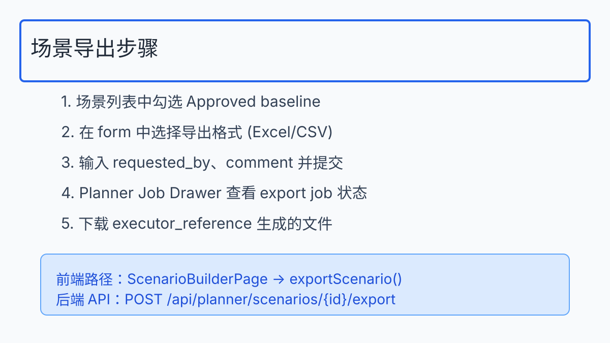
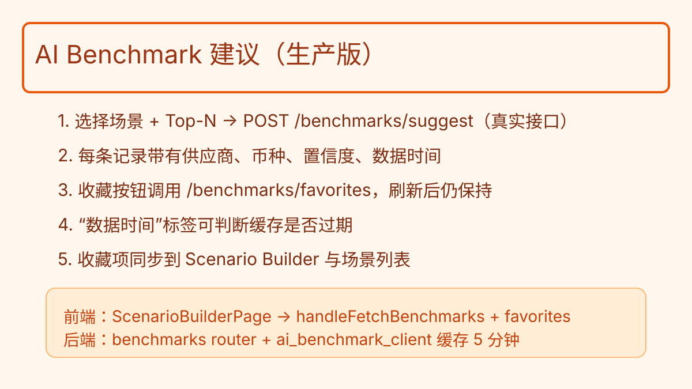

## 1. 场景导出（Scenario Export）



**适用角色**：Costing PM、Exec Reviewer  
**前提条件**：目标场景需处于 `approved` 状态。

步骤：
1. 打开 `ScenarioBuilderPage`，在左侧“场景列表”中勾选 Approved Baseline。
2. 在“导出场景”表单中：
   - 选择 `scenario_id`
   - 设定 `format`（Excel/CSV）
   - 填写 `requested_by`（用于审计）
3. 点击“导出场景”调用 `POST /api/planner/scenarios/{id}/export`。
4. 页面会自动打开 `PlannerJobDrawer`，实时轮询 `/api/planner/jobs/{job_id}`，查看 `scenario_export` 任务。
5. 当 `executor_reference` 返回后，下载生成文件（目前为占位模拟，可用于对账）。

Troubleshooting：
- 如果场景不是 `approved`，API 会返回 400。请先走审批流程，或在审批表单内设置 `set_baseline = true` 并批准。
- 若导出任务失败，`PlannerJobDrawer` 会显示 `errors` 列表，可根据 `executor_reference` 排查外部执行器。
- **已知限制**：Audit API 暂未发布，导出历史按钮会提示“功能即将上线”，如需查看记录请在 Ops 协助下查询 `audit_logs`。

## 2. AI Benchmark 建议面板



**适用角色**：Cost Analyst、Procurement Lead  
**目的**：基于历史/行业数据为行项目或假设提供基准。

操作指南：
1. 在“AI Benchmark 建议”卡片中选择目标 `scenario_id`，设置 Top-N（3/5/10）。
2. 点击“获取建议”，触发 `POST /api/planner/benchmarks/suggest`。当前返回模拟数据结构：
   ```json
   { "id": "bench-001", "title": "...", "impact": "High", "recommendation": "..." }
   ```
3. 列表支持实时收藏，`favorites` 会在本地状态保存，便于后续定位关键建议。
4. 建议内容可直接映射到：
   - 行项目：更新数量/单价/供应商
   - 假设：更新 FX/Inflation 等参数
   - 备注：写入 `scenario_versions.notes` 作为审批上下文

最佳实践：
- 每次差异分析后再刷新 AI 建议，以便拿到最新上下文。
- 收藏功能可配合后续“预设建议”功能（Phase 3）做团队共享。
> **提示**：收藏/取消收藏需在最新正式部署的前端版本上使用；若在 preview 环境执行收藏，请重新部署前端后再操作，以免数据不同步。

## 3. 审计日志（Audit Log）


**适用角色**：QA、Internal Audit、Approver  
**作用**：追踪所有关键操作（克隆、差异、审批、导出）并满足合规。

流程：
1. 在“场景列表”卡片点击“审计”按钮，打开 `AuditLogDrawer`。
2. 前端调用 `GET /api/planner/audit?target_type=scenario&target_id={scenario_id}`。
3. Drawer 展示时间序列，字段包含：
   - `created_at`
   - `actor_id`
   - `action`（如 `scenario_clone`, `scenario_diff`, `scenario_export`）
   - `payload`（job_id、executor_reference、diff参数等）
4. 点击“下载 JSON”可导出当页数据，供审计或回放脚本使用。

审计提示：
- 克隆/导出等操作会首先写入 `audit_logs` 再 commit，确保无遗漏。
- QA 在回归时使用日志确认操作顺序是否符合“克隆 → 差异 → 审批 → 导出”的黄金链路。
- **当前限制**：`/api/planner/audit` 接口尚未开放，Audit Drawer 会提示暂不可用；如需审计数据，可由后台导出 `audit_logs` 表记录。

## 4. 常见问答

| 问题 | 答案 |
| --- | --- |
| 能否并发导出多个场景？ | 支持，每个导出请求产生独立 `planner_job`，前端可多开 `PlannerJobDrawer`。 |
| AI 建议是否实时？ | 目前为模拟数据，Phase 3 将接入外部服务，可在 `benchmark_state` 中看到加载指示。 |
| 审计日志可以过滤吗？ | 当前按 `target_type/target_id` 查询，后续可扩展时间范围或动作类型过滤。 |

更多细节：参见 `frontend/src/pages/ScenarioBuilderPage.tsx` 与 `backend/src/planner/routers`.


