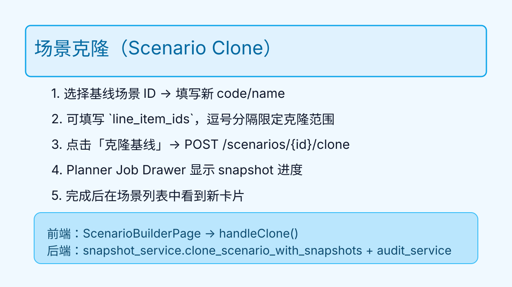
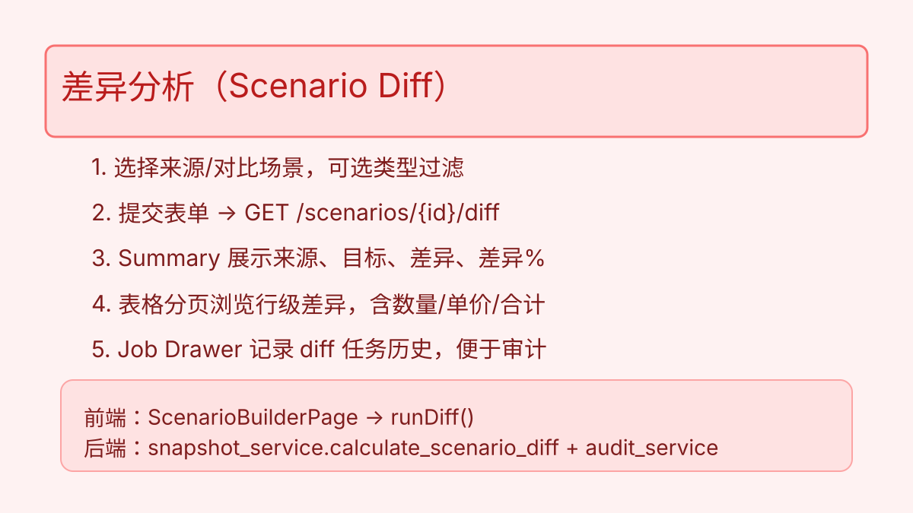
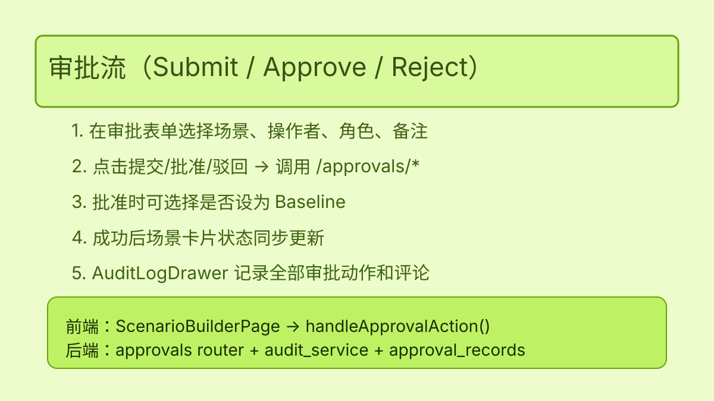
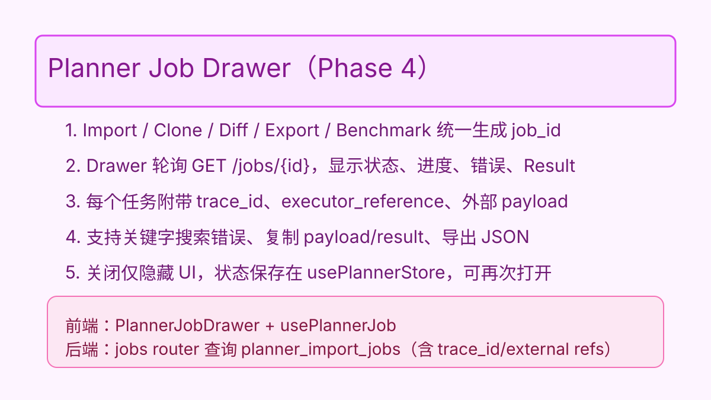

## 1. 总览
Planner 模块为财务/采购/产品运营提供「项目 → 成本包 → 行项目 → 场景」的一体化工作区。前端基于 React + Ant Design，后端由 FastAPI `/api/planner/*` 接口提供数据服务。本文覆盖日常操作步骤、常见错误与排查方式，供一线运营与 QA 参考。

---

## 2. 项目 / 成本包 / 行项目管理

### 2.1 Initiative（项目）生命周期
1. 打开 Planner 页面后左侧列表即为所有 initiative，可按状态、Owner、标签筛选。
2. 点击顶部「新建」按钮或通过后端 API `POST /initiatives` 创建，需保证 `code` 唯一。
3. 选中后右侧详情卡片展示状态、目标日期、标签、描述，可在后端或未来的编辑弹窗更新（`PATCH /initiatives/{id}`）。

### 2.2 Cost Package（成本包）
1. 在包树面板中点击「添加成本包」触发 `POST /packages`。
2. 包节点默认两级结构（parent → child），树状数据来源 `/packages/tree?initiative_id=...`。
3. 包节点选中后会过滤右侧行项目表，便于分工。

### 2.3 Cost Line Item（行项目）
1. 行表调用 `GET /line-items` 并附带 initiative/package/type 过滤参数。
2. 可在表格内直接编辑数量、单价、状态，动作会触发 `PATCH /line-items/{id}`。
3. `metadata` 字段以 JSON 存储延伸属性，前端已做透传，后续可在 Drawer 内展示结构化表单。
4. 若需要关联供应商报价，先创建 `supplier_quotes`（暂通过后端），再在行项目中引用 `preferred_quote_id`。

### 2.4 场景列表（/planner/scenarios）

1. 新增独立的“场景列表”页面，可按状态、Owner、Initiative、Baseline、收藏标签筛选，并支持模糊搜索。
2. 行内支持收藏/取消收藏，前端会调用 `/api/planner/scenarios/{id}/favorite` 持久化到后端（收藏在 Scenario Builder 与列表间同步）。
3. 复选后可执行批量操作：
   - **批量提交**：仅 `draft/rejected` 场景可提交到审批流。
   - **批量导出**：仅 `approved` 场景允许导出，执行后统一在 Planner Job Drawer 中追踪任务，Trace ID/Job ID 均可一键复制。
4. 表格列展示上次导出时间、Owner、Initiative 等信息，便于生产环境快速筛选基线；离线/超时会在顶部 Alert 提示，同时沿用上次成功数据。

### 2.5 网络异常与离线模式
- 所有列表（initiative、场景、导出历史、AI 收藏）顶部都有告警条，显示“离线/超时/认证失败”信息，并提供“重试”按钮。
- 长耗时操作（CSV 导入、克隆、提交、审批、导出、AI 建议、收藏）统一使用 `message.loading` + 成功/失败 toast，便于远程协作同事了解状态。
- `.env.production` 设置 `VITE_PLANNER_SSE_URL` 与 `VITE_ENABLE_JOB_SSE=true` 后，Job Drawer 自动切换 SSE 推送；若 SSE 不可用则回退到 2 秒轮询。

### 2.6 物料主数据（/costing/materials）
1. 入口：左侧菜单「成本核算 → 物料管理」，依赖 `GET /api/planner/base-config/materials`。
2. 筛选：支持关键词（编码/名称）、物料类型（原材料/虚拟/组件）、状态（草稿/在用/停用）、“仅启用”快速开关，提交后分页调用 API。
3. 启用 / 停用：表格右侧开关调用 `PATCH /base-config/materials/{id}`，成功后会有 toast 并自动刷新列表。
4. 导出：点击「导出」触发 `POST /base-config/materials/export`，后端会返回下载链接或异步 job_id（CSV/XLSX）；浏览器会新开标签页下载。
5. 手动同步：点击「同步宜搭」按钮会弹出确认框并 POST `/base-config/materials/sync-yida`；同步记录可在右上角按钮打开抽屉查看。
6. 同步日志：Drawer 分页调用 `GET /base-config/materials/sync-jobs`，展示创建/更新/停用/跳过统计、耗时、开始/结束时间，方便 Ops 对齐 YiDa 定时任务结果。
> **提示**：若后端尚未写入真实数据，页面会显示“暂无数据/暂无同步记录”；待同步成功后刷新即可看到最新结果。

---

## 3. CSV 导入流程

### 3.1 准备模板
- 官方示例：`DOC/costing/qa/sample_data/line_items_sample.csv`。
- 必填列：`package_id`, `type`, `description`, `unit_of_measure`, `quantity`, `unit_cost_estimate`, `currency`。

### 3.2 导入步骤
1. 在 Planner 工作区点击「导入 CSV」。
2. 选择文件并绑定 initiative → 前端通过 FormData 调用 `POST /line-items/import`。
3. 成功后会获得 `job_id`，系统自动打开 Planner Job Drawer 轮询 `/line-items/import-jobs/{id}`。
4. Drawer 中可以查看进度（`processed_rows/total_rows`）以及错误列表。

### 3.3 常见错误
| 错误 | 触发条件 | 排查建议 |
| --- | --- | --- |
| Missing required columns | CSV 缺少必填字段或列名拼写错误 | 核对模板，确认列名及大小写 |
| Package does not exist for initiative | `package_id` 不属于目标 initiative | 在包树中复制正确 ID 或先创建包 |
| metadata must be valid JSON | `metadata` 列非 JSON 格式 | 使用 `{\"key\":\"value\"}` 形式或直接留空 |

---

## 4. 场景操作（克隆 / 差异 / 审批 / 导出 / AI）

### 4.1 克隆基线

1. 在「克隆基线」表单输入基线 ID、目标 code/name，视情况填写 `line_item_ids`。
2. 点击按钮后将调用 `POST /scenarios/{id}/clone`，新场景会自动加入左侧列表。
3. 若 Job Drawer 显示失败，复制错误信息给后端以定位具体行。

### 4.2 差异分析

1. 选择来源与对比场景，可选类型过滤（材料/人工等）。
2. 提交后调用 `GET /scenarios/{id}/diff`，summary 与表格将展示差异值。
3. 可通过表格分页查看更多行，Job Drawer 记录 diff 任务方便追溯。

### 4.3 审批流

1. 在审批区域选择场景、操作者、角色、备注，可勾选「批准后设为 Baseline」。
2. 点击提交/批准/驳回分别对应 `/approvals/submit|approve|reject`。
3. 成功后场景卡片状态会立即刷新；所有动作被写入 `approval_records` + `audit_logs`。

### 4.4 导出

1. 只能导出 `approved` 场景，否则会收到 400 错误。
2. 填写 `scenario_id`、`format`、`requested_by` 后提交 `POST /scenarios/{id}/export`。
3. Job Drawer 会显示导出任务并附带 trace ID、执行器引用号，方便对账。
4. 在 Scenario Builder 左侧新增“导出历史”时间轴，可按 Trace/备注搜索并分页查看 `/audit` 返回的导出记录。

### 4.5 AI Benchmark

1. 选择场景并设置 Top-N，然后点击「获取建议」触发 `POST /benchmarks/suggest`，Phase 3.5 已改为真实接口，会返回供应商、币种、置信度、数据更新时间等字段。
2. 每条建议可收藏/取消收藏，调用 `/benchmarks/favorites` 持久化，收藏状态在刷新后仍然生效，并在 UI 中以星标展示。
3. 建议列表支持“数据时间”提示，便于判断缓存是否过期。
> **注意**：服务器端收藏功能依赖正式部署的最新前端构建，若在 preview/临时环境操作需重新执行 `npm run build && 部署` 后再使用收藏，以免状态不同步。

### 4.6 审计/历史

1. 场景卡片新增「审计」按钮，打开新的 Audit Drawer（分页 + 关键字 + Trace ID 过滤），实时调用 `/api/planner/audit?target_type=scenario&target_id=...`。最新实测截图与 CLI 流程见 `DOC/costing/images/go-live-20251214/planner-smoke-audit-drawer-20251214.png` 及 `cli-smoke-log-20251214.txt`。
2. 导出历史、审批、克隆等关键信息均写入审计，并可一键复制 Trace ID 与 Metadata、导出 JSON。若后端暂未放通 `/api/planner/audit`，界面会显示“功能即将上线”提示，并提供“重新检查”按钮。
> **当前限制**：生产环境尚未部署新 Audit Router 时仍会返回 404；如需查阅记录，请联系 Ops/Backend 直接查询 `audit_logs`，或参考上述 CLI 日志。

---

## 5. PlannerJobDrawer / AuditLogDrawer

### 5.1 Planner Job Drawer

1. 任一异步任务（CSV 导入、克隆、差异、导出）都会返回 `job_id` 并自动开启 Drawer。
2. Drawer 每 3 秒调用 `GET /api/planner/jobs/{id}`，展示状态、进度、错误、结果，并额外显示 trace ID、外部引用号，支持一键复制。
3. 支持错误搜索过滤、Payload/Result 一键复制，关闭 Drawer 仅隐藏 UI，状态保存在 `usePlannerStore`，可随时重新打开。

### 5.2 Audit Log Drawer

1. 在场景卡片点击「审计」按钮打开 Drawer。
2. Drawer 支持 Trace ID 过滤、关键字搜索、分页浏览，便于定位特定导出/审批记录。
3. 列表可复制 Trace/Metadata，并可导出 JSON 用于审计或 QA 回放。

---

## 6. 常见问答 & Known Issues

| 问题 | 答案 |
| --- | --- |
| CSV 导入是否支持增量？ | 是，重复 `reference_code` 会新增行；如需更新请通过行表编辑或后端脚本。 |
| 能否批量审批？ | 当前 UI 为单条审批；后端支持批处理接口在 Phase 4 规划中。 |
| AI 建议多久刷新一次？ | Phase 3.5 接入真实 provider，默认缓存 5 分钟并展示“数据时间”。若需强制刷新，可点击「刷新数据」按钮。 |
| Job Drawer 可以订阅通知吗？ | `.env` 启用 SSE 或消息推送（钉钉/邮件）后，长耗时任务完成会自动通知；若依赖不可用则回退轮询。 |
| 知名问题：导出历史加载慢 | Trace 过滤会触发分页查询，建议缩短时间范围或按 Trace 精确检索；Phase 4 计划引入 Elastic 索引。 |
| 知名问题：收藏状态不同步 | 若后端消息总线异常，收藏状态可能延迟；可手动刷新列表或在 Task Log 记录事件供运维排查。 |

---

## 7. 参考资料
- 需求总览：`DOC/costing/requirements.md`
- 架构说明：`DOC/costing/architecture.md`
- QA 回归计划：`DOC/costing/qa/regression_plan.md`
- 示例数据：`DOC/costing/qa/sample_data/*.csv`

