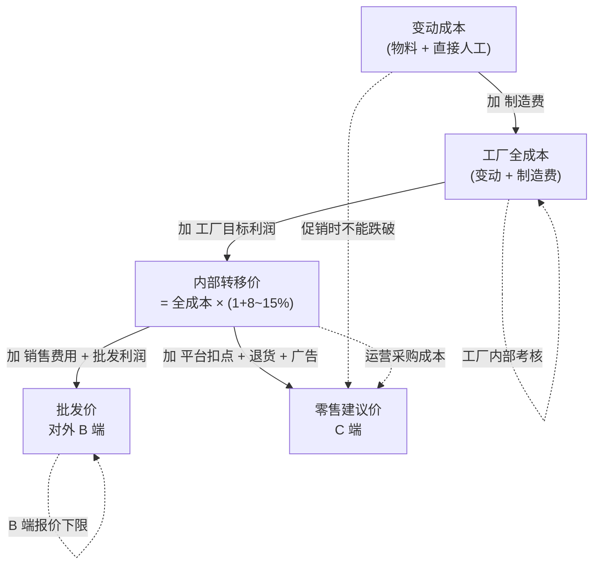

```guozong
- 这本手册解决一个具体痛点：以前工厂只算"全成本 44.55"给运营，运营拿不下手——核心矛盾是"工厂内部口径"和"运营外销口径"被强行混用。
- 专业 ERP 的标准做法（SAP/Oracle/金蝶 K3）是引入"内部转移价"，让两套账独立运转、月度抵消。本手册把这套机制落到我们这套小而精的系统上。
- 关键决策：(1) 工厂目标利润率按品类分档；(2) 月度审核且不超过半年不动；(3) 月底差异大于 5% 必须复盘；(4) 集团层面合并报表时内部利润抵消，不影响整体利润。
```

---

## 一、为什么必须引入"内部转移价"

### 1.1 你们当前的痛点

> "工厂算出 44.55 给运营，运营说卖不出去（同行 26 元就能批发到），但工厂说自己已经亏本……"

这个矛盾的本质是：**两个公司用了同一个数字干了三件不同的事**。

| 数字 | 用途 | 应该是谁的口径 |
|---|---|---|
| 44.55（工厂全成本） | 工厂内部考核盈亏 | 工厂会计 |
| 44.55（同 44.55 给运营） | 运营采购成本 | **错——运营不该承担工厂的全成本** |
| 44.55（基于此对外报价） | 对外销售价 | **错——还要叠加运营成本和利润** |

### 1.2 SAP / 行业的做法

行业标准是 **"FI + CO 联动 + 内部转移价"**：

```text
工厂会计 (FI): 算"工厂全成本"，考核工厂 KPI
管理会计 (CO): 设"内部转移价"，工厂卖给运营这个价格
运营会计 (FI): 用"内部转移价"作为采购成本，算运营毛利
集团合并:    工厂利润 + 运营利润 = 集团利润（内部往来抵消）
```

**这是教科书做法**，所有 SAP 客户都是这么干的。我们这套系统从 v2 起也按这个思路走。

---

## 二、三层价格的财务含义

### 2.1 一图看懂



### 2.2 各层价格的"使用场景"

| 价格层 | 谁能看 | 用在哪 | 典型对话 |
|---|---|---|---|
| **变动成本** | 工厂 + 运营 | 大促/秒杀/清仓的"绝对底价" | "再低就要补钱了" |
| **工厂全成本** | 工厂会计 | 工厂月度 KPI、绩效考核 | "我厂今月毛利率是 X%" |
| **内部转移价** | 运营采购 | 日常进货成本、运营毛利计算 | "我从工厂拿货是 Y 元" |
| **批发价** | 销售部门 | 给经销商/分销商的报价 | "我们出厂批发是 Z 元" |
| **零售价** | 运营 + 老板 | 各平台店铺的标价指引 | "建议挂多少能保利润" |

### 2.3 集团层面的合并

```text
集团利润 = 工厂利润（含工厂目标利润率）+ 运营利润（基于内部转移价算）
        - 内部往来抵消（工厂的销售收入 vs 运营的采购成本）

实际操作：
- 工厂账：销售收入（按内部转移价 × 数量）- 工厂全成本 = 工厂利润
- 运营账：销售收入（按零售价 × 数量）- 内部转移价采购 - 运营费用 = 运营利润
- 集团账：消除内部往来后，等于 (零售价 × 数量) - 工厂全成本 - 运营费用
```

> 这与"两公司全年利润直接相加"等价（数学上），但**两边各自的考核指标独立可见**，这才是引入转移价的根本价值。

---

## 二·补) 转移价的"四线约束"⭐（v1.1 新增 / 已采纳外部评审）

> **关键认知**：转移价不能只算"全成本 × (1 + 利润率)"。如果工厂效率不达标导致全成本高于同行批发价，机械加价后给运营，运营卖不出去，最后还是集团亏。**转移价必须同时受 4 条线约束**。

| 约束线 | 来源 | 作用 | 落库字段 / 触发动作 |
|---|---|---|---|
| **成本线** | 工厂全成本 cost_factory_full | 工厂效率底线 | 转移价 ≥ 成本线 × (1 + 1%)（最低利润防呆） |
| **市场线** ⭐ | 同行批发价 / 1688 公开价 / 同款竞品采购价 | 市场公允锚点 | 转移价 > 市场线 → **报警"工厂成本竞争力不足"** |
| **税务线** | 关联交易公允性区间 | 税务合规 | 关联交易留存"市场询价记录"，区间 ±15% |
| **战略线** | 引流 / 清仓 / 爆款打造 | 业务策略 | 低于上述 3 线时**走特批 + 单独入"战略补贴账"** |

### 二·补.1 市场线数据怎么来

| 来源 | 频次 | 责任人 | 数据落库 |
|---|---|---|---|
| 1688 公开报价 / 拼多多店铺 | 季度 | 采购 | `market_price_reference` 表 |
| 同行 / 竞品采购询价单 | 月度 | 采购 | 同上 |
| 客户对比反馈（运营反向上报） | 实时 | 运营 | `market_price_feedback` 表 |
| 行业展会 / 同业公会 | 半年度 | 老板 / 集团财务 | 同 `market_price_reference` 表 |

```sql
CREATE TABLE market_price_reference (
  id BIGSERIAL PRIMARY KEY,
  category VARCHAR(32) NOT NULL,
  size_spec VARCHAR(32),
  material_main VARCHAR(64),
  reference_source VARCHAR(32) NOT NULL,   -- '1688' / 'pdd' / 'competitor_quote' / 'show'
  source_url TEXT,
  source_screenshot_path TEXT,             -- 留证用
  market_unit_price DECIMAL(12,2) NOT NULL,
  unit VARCHAR(16) NOT NULL,               -- 'piece' / 'sqm' / 'kg'
  collected_at DATE NOT NULL,
  collected_by VARCHAR(32) NOT NULL,
  remark TEXT
);
CREATE INDEX idx_market_cat_collected ON market_price_reference(category, collected_at DESC);
```

### 二·补.2 高于市场线时怎么办

```text
转移价计算流程（伪代码）:

cost_factory_full = compute_full_cost(sku)
target_profit_rate = lookup_category_profit_rate(category) × monthly_adjust_coef()
price_transfer_calculated = cost_factory_full × (1 + target_profit_rate)

market_ref = get_market_reference(category, size_spec, material_main)
if market_ref:
    if price_transfer_calculated > market_ref.market_unit_price × 1.05:
        # 超出市场参考价 5% → 报警
        alert("工厂成本竞争力不足", sku, price_transfer_calculated, market_ref)
        price_transfer = price_transfer_calculated  # 不强制压降，但要让老板看见
        cost_competitiveness_flag = "weak"
    else:
        price_transfer = price_transfer_calculated
        cost_competitiveness_flag = "ok"
else:
    price_transfer = price_transfer_calculated
    cost_competitiveness_flag = "no_market_data"
```

> **报警不等于强制压价**——报警的目的是让老板和工厂看到："这个 SKU 已经被同行卷输了"，下一步是工厂改进效率 / 找替代材料 / 换品类，而不是让运营硬扛压价。

### 二·补.3 战略补贴单独入账

引流款 / 清仓款 / 爆款打造时，转移价可能 **低于工厂全成本**——这是策略，不是亏损。但**不能让工厂账面亏损吃下来**，要单独入"战略补贴账"。

```sql
CREATE TABLE strategic_subsidy_log (
  id BIGSERIAL PRIMARY KEY,
  sku_code VARCHAR(64) NOT NULL,
  shop_id INT NOT NULL,
  start_date DATE NOT NULL,
  end_date DATE,
  reason VARCHAR(32) NOT NULL,             -- 'traffic_pull' / 'clearance' / 'new_launch'
  cost_factory_full DECIMAL(12,2) NOT NULL,
  price_transfer_actual DECIMAL(12,2) NOT NULL,  -- 实际转移价（低于全成本）
  subsidy_per_unit DECIMAL(12,2) NOT NULL,        -- = cost_factory_full - price_transfer_actual
  expected_qty INT,
  expected_total_subsidy DECIMAL(14,2),
  approved_by VARCHAR(32) NOT NULL,
  approved_at TIMESTAMP NOT NULL,
  remark TEXT
);
```

**月底结算时**：
- 工厂账上不再"亏"——补贴金额从"集团战略费用"科目转入工厂；
- 集团口径上把"战略费用"单列，避免污染品类毛利分析；
- AI 周报 / 月报里 `traffic_loss` 类 SKU 报亏损时，要先扣掉补贴再判断是否真超预算。

---

## 三、关键参数：工厂目标利润率怎么定

### 3.1 行业经验区间

| 品类特征 | 工厂目标利润率 | 解释 |
|---|---|---|
| 标准化大批量（如标准画框） | 5%-8% | 自动化 + 规模效应，利润薄但稳 |
| 常规小批量（如冰丝沙发垫） | 8%-12% | 多品种小批量，本类是你们主战场 |
| 难做的特殊品（如异形/超大尺寸） | 12%-18% | 换线多、不良品高、损耗大 |
| 定制品/打样品 | 18%-30% | 完全非标，每单都是新单 |

### 3.2 你们的"混合方式"（用户选定）

按品类分档基础利润率 + 月度反推调节系数：

```text
最终工厂利润率 = 品类基础利润率 × 月度调节系数

月度调节系数 = 1.0 + (上月工厂实际净利率 - 工厂目标净利率) × -0.5

例：
- 品类基础利润率：10%
- 上月工厂实际净利率：12%（高于目标 5%）
- 调节系数：1.0 + (12% - 5%) × -0.5 = 0.965
- 本月工厂利润率：10% × 0.965 = 9.65%

含义：上月赚多了，本月让一点利给运营/客户；上月不达标，本月稍微提一点。
这样工厂利润不会失控，长期围绕目标净利率波动。
```

### 3.3 参数管理流程

| 频次 | 谁来做 | 做什么 |
|---|---|---|
| 月初 5 号前 | 集团财务 | 根据上月实际数据，由系统自动计算下月调节系数 |
| 月初 7 号前 | 财务 + 工厂 + 运营三方会议 | 评审本月各品类工厂利润率，特殊品类可手工微调 |
| 月初 10 号 | 财务 | 锁定本月转移价，落库到 `price_layering_settings` |
| 季度末 | 集团财务 | 复盘当季利润率，调整下季"品类基础利润率" |
| 半年度 | 老板 + 集团财务 | 复盘整体策略，是否需要换"基础利润率" |

> **关键纪律**：本月转移价一旦锁定，本月内不能改（除非系统紧急异常）。否则运营无法做日常报价。

---

## 四、运维清单：怎么在系统里操作

### 4.1 设定品类基础利润率

```text
路径：管理后台 → 财务设置 → 品类利润率配置
权限：仅集团财务负责人可改

字段：
- 品类（下拉，从 product_model_category 取）
- 基础利润率（百分比）
- 生效起始日
- 生效结束日（可空，表示长期有效）
- 备注
```

### 4.2 设定月度调节系数（系统自动）

```text
路径：管理后台 → 财务设置 → 月度调节系数
触发：每月 5 号 cron 自动跑（finance API 取上月数据）

字段：
- 年月（YYYY-MM）
- 上月工厂实际净利率（自动从 finance 取）
- 工厂目标净利率（手工录入）
- 调节系数（自动算）
- 状态（待审 / 已生效）
```

### 4.3 锁定本月转移价

```text
路径：管理后台 → 财务设置 → 月度转移价锁定
权限：财务 + 老板双签

每月 10 号前必须完成：
- 系统按"基础利润率 × 月度调节系数"算出本月各品类的工厂利润率
- 财务复核 → 老板审批 → 状态改为 'locked'
- 本月所有"内部转移价"自动从这套参数取
```

### 4.4 月度对账

```text
路径：管理后台 → 财务对账 → 转移价复盘
触发：每月 5 号 cron 自动跑

输出：
- 工厂当月销售收入（按内部转移价 × 数量）
- 工厂当月全成本（实际）
- 工厂当月利润（差额）
- 工厂当月利润率（与目标对比）
- 运营当月销售收入（按零售价 × 数量）
- 运营当月内部采购成本（按转移价 × 数量）
- 运营当月毛利
- 集团当月利润（合并后）

差异分析：
- 工厂利润率与目标差异 > 3 个百分点 → 报警
- 集团利润率月环比下降 > 10% → 报警
```

---

## 五、典型场景演练

### 5.1 场景 A：日常报价

> 客户：90×90 冰丝沙发垫，1000 件，多少钱？

```text
1. 运营查 SKU 成本卡 → 内部转移价 = 21.26 元/件
2. 加上运营成本：包装 1.5 + 运费 4.0 + 平台扣点 3% × 售价
3. 加上目标毛利：30%
4. 倒推零售价 = 21.26 / (1 - 30% - 3%) - 5.5 = 26.2 元
5. 加价 50% 销售（含活动空间）= 39 元

报价：39 元/件，活动可让到 32 元，绝对底线 21.26（变动成本+运营变动）
```

### 5.2 场景 B：月底盘点

> 集团财务：本月集团利润是多少？

```text
按系统月度对账报表：
- 工厂账：销售收入 1,500,000（按转移价）- 工厂全成本 1,360,000 = 140,000 工厂利润
- 运营账：销售收入 2,100,000（零售价）- 采购成本 1,500,000 - 运营费 480,000 = 120,000 运营利润
- 内部抵消：工厂收入 1,500,000 = 运营采购 1,500,000 → 抵消
- 集团合并：销售收入 2,100,000 - 工厂全成本 1,360,000 - 运营费 480,000 = 260,000

集团利润 260,000 = 工厂 140,000 + 运营 120,000 ✓
```

### 5.3 场景 C：工厂亏损追责

> 老板：这个月工厂利润为什么只有 5%？目标 10%！

```text
财务调系统月度对账：
- 工厂目标利润率 10%（已锁定）
- 工厂实际利润率 5%
- 差异 -5% → 钉钉报警已触发

逐项追：
- 制造费率上月 0.20 → 本月 0.27（涨了 35%）→ 主因
- 间接费 +14 万：水电费多了 8 万（夏季空调）+ 人工外包多了 6 万（赶单）
- 决策：
  - 短期：本月调节系数 +0.10 补偿（下月转移价上调）
  - 长期：评估水电费/人工管控

结论：账算得清，问题定位在"水电+加班"，不是"运营压价"
```

### 5.4 场景 D：运营冲量价

> 双 11 想做爆款，能不能砍价到 15 元？

```text
变动成本（材料+人工）= 13.5
内部转移价 = 21.26
工厂全成本 = 19.33

15 元 vs 13.5 → 还能赚 1.5/件
但 15 元 < 内部转移价 21.26 → 工厂账面亏 6.26/件

决策路径：
- 走"促销特批"流程
- 工厂账亏的部分，由集团从运营预算中拨补（或老板特批）
- 落库到 finance_adjustments 表，月底单列考核

这种"短期穿透转移价"是常见操作，但必须有审批流和单独账，不能把日常转移价拉低
```

---

## 六、常见误区与正解

### 6.1 误区 ❌：转移价就是工厂全成本

正解 ✓：转移价 = 工厂全成本 × (1 + 工厂目标利润率)。如果转移价 = 全成本，工厂永远 0 利润，工厂经理没动力。

### 6.2 误区 ❌：转移价就是市场价

正解 ✓：转移价是**集团内部**的会计科目，不是市场公允价。可以参考市场价但不必等同。如果远低于市场价，工厂利润会失真；远高于市场价，运营会有意见。

### 6.3 误区 ❌：每天根据成本变化调转移价

正解 ✓：转移价至少按月稳定。日常成本波动应该通过"工厂利润率波动"来吸收，不是频繁调整转移价。否则运营无法定价。

### 6.4 误区 ❌：内部转移价不需要交税

正解 ✓：**两个独立法人之间的内部交易，需要按市场公允价开票纳税**（涉及增值税）。如果转移价偏离市场价过大，可能触发关联交易调查。建议参考 `/home/admin/projects/finance-analyzer/DOC/税务分析_艺境云画增值税结构_202601.md` 的税务结构。

### 6.5 误区 ❌：只有工厂赚钱、运营不赚钱也行

正解 ✓：长期看必须**两边都有合理利润**，否则一方没动力。如果运营长期不赚钱，可能是转移价定高了，需要降；如果工厂长期不赚钱，可能是转移价定低了，需要升。

---

## 七、与 finance-analyzer 的协同

### 7.1 关键数据流

```text
finance-analyzer (FI)
  ↓ 拉真实间接费、人工成本
ai-costing (CO/管理会计)
  ↓ 算工厂全成本 + 转移价
ai-costing 落库 SKU 成本卡（含 8 个价格字段）
  ↓ 运营查询
运营接订单 → 出货 → ai-costing 算订单理论利润
  ↓ 月底对账
finance-analyzer 拉 ai-costing 的发货数据
  ↓
集团权责制利润分析
```

### 7.2 月度抵消会计分录

> 这里给会计/老板看，技术同事可跳过

```text
工厂账：
  借：应收账款 - 运营公司    1,500,000
  贷：主营业务收入            1,500,000  （按转移价）

运营账：
  借：库存商品 / 主营业务成本  1,500,000
  贷：应付账款 - 工厂公司      1,500,000

集团合并报表：
  抵消分录：
  借：主营业务收入            1,500,000
  贷：主营业务成本            1,500,000

  最终集团合并的 P&L 里只剩对外的销售收入和最终成本
```

---

## 八、上线后的常见问题（FAQ）

### Q1：运营说"工厂的转移价比同行高，我们卖不动"怎么办？
A：先看是不是"工厂全成本"高（追制造费、人工、物料），再看"工厂目标利润率"是否合理。如果全成本本身就比同行高，问题在工厂效率，不在转移价。

### Q2：工厂说"我们目标利润率 10% 太低，应该 15%"怎么办？
A：财务+老板复盘：工厂利润率 ≥ 行业平均 + 工厂自身的合理回报。如果工厂确实在做高难度品类（小批量、定制），可以分品类拉高。

### Q3：本月转移价定错了，下月还要不要回追？
A：原则不回追。本月差异通过"月度调节系数"在下月吸收。否则会反复改账，无法对账。

### Q4：转移价怎么开票？开多少？
A：按转移价 × 数量开内部销售发票。需要符合税务"关联交易公允性"要求，建议参照市场询价的 ±20% 区间。

### Q5：促销时跌破转移价怎么办？
A：走"促销特批"流程，差额单列到 `finance_adjustments`，月底由运营预算/老板特批补账，不影响日常转移价。

---

## 九、签字页

| 角色 | 签字人 | 日期 | 备注 |
|---|---|---|---|
| 集团财务负责人 | | | 确认参数管理流程 + 对账阈值 |
| 工厂总账 | | | 确认工厂利润率合理 |
| 运营负责人 | | | 确认转移价可作为采购成本 |
| 老板 | | | 确认整体机制 |

---

*文档版本：v1*  
*创建日期：2026-05-08*  
*下次评审：本机制运行 3 个月后（约 2026 年 8 月）*
